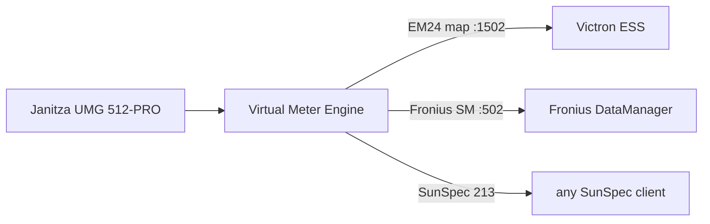

# Multi-Bus Gateway

> formerly *Janitza UMG 512-PRO Monitor* — a multi-source protocol gateway: Modbus TCP/RTU · HTTP/JSON · MQTT → MQTT / InfluxDB / virtual Modbus meters / HTTP-JSON / REST

[🇷🇴 Română](README.md) | 🇬🇧 **English**

[](https://github.com/sm26449/janitza-monitor/releases)
[](https://github.com/sm26449/janitza-monitor/pkgs/container/janitza-monitor)


[](LICENSE)

> **Software-defined Modbus-to-MQTT gateway — retrofit, don't replace.**

Bring an existing Janitza UMG power-quality analyzer to modern MQTT / IoT platforms — **no rip-and-replace, no dedicated gateway box**. It reads the meter over Modbus TCP and publishes to **MQTT, InfluxDB, Grafana and Home Assistant** — and, uniquely, re-serves that single physical meter as **several virtual Modbus devices** (Carlo Gavazzi EM24, Fronius Smart Meter, SunSpec), so Victron, Fronius and others each see the meter they expect. Everything runs in a container — *the approach hardware vendors now ship dedicated appliances for, in software you control.*

- 🔌 **Retrofit instead of replacement** — digitize an installed meter; **zero new hardware**.
- ☁️ **Modbus data to the cloud** — MQTT → InfluxDB, Grafana, Home Assistant autodiscovery.
- 🪞 **One meter, many consumers** — serve a single physical device as multiple virtual Modbus meters.
- 🌍 **Operator-grade UI** — multi-language, live monitoring, history & monthly energy, alerting.


📖 **[User Manual](docs/MANUAL.md)** · 🔌 **[Virtual Meter guide](docs/VIRTUAL-METER.md)**

## Why software, not a box?

A dedicated Modbus-to-MQTT appliance is one option. This is the other: the same job in software you own and can extend — running on hardware you already have, or on a ~€50 Raspberry Pi with a USB/HAT RS-485 (and CAN) adapter, DIN-rail-mountable all the same. No vendor lock-in, no per-box cost.

- ⚡ **Configurable sub-second polling** — tunable per poll-group with no fixed floor (we run 250 ms on the realtime group); fixed-function gateways typically stop at ~5 s.
- ♾️ **No device / value caps** — bounded only by your host, not a fixed 10-device / 1000-value limit.
- 🪞 **Virtual meters** — re-serve one physical meter as many emulated devices (Victron, Fronius, SunSpec); a read-only gateway can't.
- 🔓 **Open-source, commodity hardware** — inspect it, fork it, add a protocol; run it on a Pi.

## Features

- **Modbus TCP Reader** - Direct connection to Janitza device
- **MQTT Publishing** - With Home Assistant autodiscovery support
- **InfluxDB Publishing** - Time-series storage
- **🛡️ No data loss across InfluxDB outages** - in-RAM store-and-forward buffer (10 min default, configurable): points produced while InfluxDB is down are replayed on reconnect **with their original timestamps** (idempotent - no duplicates). Points are stamped at Modbus read time, and Modbus polling never depends on MQTT/InfluxDB - each pipeline reconnects independently.
- **"Changed" Mode** - Publish only modified values (reduces traffic)
- **Professional Web UI** - Dashboard, Devices (per-device workspace), Config, Virtual Meters
- **Real-time WebSocket** - Live updates in UI
- **Hot-reload** - Configuration changes without container restart
- **Flexible Configuration** - Custom MQTT topics and InfluxDB tags per register
- **Poll Groups** - Different intervals for different data types
- **Thresholds** - Color coding for values (warning/danger)
- **Unit Scaling** - Automatic Wh→kWh, W→kW, VA→kVA conversion for readability
- **Gauge Widgets** - Configurable min/max/color with threshold-based coloring
- **🔌 Virtual Meters** - Serve one Janitza as **many virtual meters** (Carlo Gavazzi EM24 for Victron, Fronius Smart Meter for the DataManager, SunSpec…), defined as templates, with **full observability** of every Modbus request. See **[docs/VIRTUAL-METER.md](docs/VIRTUAL-METER.md)**.
- **🧩 Multi-device gateway** - Read **multiple sources** — Modbus TCP, Modbus RTU (in progress), **HTTP/JSON** (e.g. a Fronius meter over the Solar API, or any JSON endpoint via per-register `json_path`) and **MQTT** (subscribe to a broker and read values from the JSON payload or bare numbers, with a per-register topic + `+`/`#` wildcards) — through **device templates** (the register map as a portable file, with an in-UI editor + upload + export). Each device gets its **own tabbed workspace** and **its own routing**: per-device MQTT topic prefix, InfluxDB bucket, virtual-meter outputs, and its own Monitor/History/Energy. 3-step "Add Device" wizard with a real connection/read test.
- **🔎 Modbus auto-discovery** - Scan a LAN range on the Modbus port (default 502) for devices that answer + sweep unit-ids on one endpoint; "Use" prefills the wizard. Read-only, LAN-restricted.
- **🧮 Calculated measurements** - Derive new measurements by formula (power factor, phase sums, unit conversions, imbalance, `(E - prev(E)) / dt * 3600` for power from an energy counter) with a safe evaluator; they flow to **every** output like any measurement and appear in Monitor and History. Builder with Measurement-field chips + functions + live preview + presets ("save as your own template").
- **📤 Per-device outputs** - Besides MQTT/InfluxDB/virtual meters: **HTTP/JSON output** (serve live values at `GET /api/meters/<id>`, Solar-API style) and **REST push** (periodic JSON telemetry POST to a URL/webhook/cloud, with masked auth headers). Each opt-in per device, in the Outputs tab.
- **pv-stack Integration** - Service template for Docker Services Manager

## 🔌 Virtual Meters

One UMG 512-PRO at the grid connection point measures everything. But Victron
wants a *Carlo Gavazzi EM24*, Fronius wants a *Fronius Smart Meter*, another
system wants SunSpec. Instead of buying three meters, you **define them as
templates** and serve them all from the meter you already have — each an isolated
Modbus-TCP server fed from the live values, with a **freshness watchdog** (stale
source → stop responding, so the consumer's own fail-safe engages).



**Two modes:** ① run *parallel* to the real meter to validate risk-free, then
② *consolidate* — the virtual meter replaces the physical one. Full query-log
observability the whole way.

Plus **built-in observability**: the last 1024 queries (time/FC/addr/count/
response/latency), counters, tx/rx, a requests-per-second chart — the very tool
we used to reverse-engineer the Fronius Smart Meter protocol (case study in the doc).

→ **Full guide with diagrams, examples and how to contribute: [docs/VIRTUAL-METER.md](docs/VIRTUAL-METER.md)**

### Composite meters (multi-source aggregator)

A virtual meter can now gather registers from **many sources at once** —
Janitza + an HTTP inverter + MQTT sensors — into one Modbus TCP map and one
JSON feed (`/api/virtual-meters/<id>/values`): a PLC/SCADA reads everything in
a single poll. In the editor a row's source can be `device.register` (grouped
per device in the picker), each row with its own freshness bound (a 60s BLE
sensor next to a 250ms Janitza row).

**The staleness convention** (absence is NEVER served as 0/false — a frozen
value can mislead a control loop):

| Policy (`on_stale`) | Stale/missing register | Use for |
|---|---|---|
| `legacy` (default) | classic single-source behavior: one instance-level watchdog | existing meters — untouched |
| `fail` | any read touching it → **Modbus exception**; spanning blocks refused (no partial truth) | control consumers (Victron, PLC) |
| `sentinel` | **SunSpec N/A**: float→NaN, int16→0x8000, uint16→0xFFFF… | sentinel-aware consumers |
| `hold` | last value up to `max_hold_s`, then like `fail` | tolerant displays |

Sums take the quality of their **worst** member — never partial. In JSON:
`value: null` + `quality: good|stale|missing` + `age_s`, with `last_value`
kept separate. The server stays up while at least one source is fresh; all
dead → it stops (the consumer's fail-safe takes over).

## 🧩 Devices & Device Templates (multi-device)

The register map is no longer hardwired to one meter: it lives on a **device
template** — a portable JSON artifact describing an equipment type (registers
with units, descriptions, data types, categories, suggested poll groups, and
optional per-register presets for MQTT/InfluxDB/UI). The Janitza UMG 512-PRO
ships **built-in** (4,126 registers in 29 categories, curated defaults for the
common electrical measurements); any other meter is a template away.

**Config → Devices** shows every southbound meter with live health (status,
poll rate, data age) and its northbound routing at a glance. **Add Device** is
a 3-step wizard:

1. **Connection** — Modbus TCP (host/port/unit id, with a real **Test
   connection** probe: any protocol-level answer, even a Modbus exception,
   proves the device is alive) or Modbus RTU (serial).
2. **Template** — pick from the library, **upload** a template file (validated
   row by row before anything is saved), or **create one in the editor**
   (metadata + register table with search and inline validation; built-ins are
   read-only — *Duplicate to edit*; templates in use can't be deleted).
3. **Data routing** — device name + id (the id is the routing key), **MQTT
   topic prefix** with a live preview of a real topic, and the **InfluxDB
   bucket** + device tag. Each device publishes to its own topics and writes
   to its own bucket — no single global sink.

The Registers page is template-driven: it renders the catalog of whatever
device you're configuring, and each device keeps its own register selection
with hot reload of only its own pollers.

**Migration is invisible**: an existing single-meter install becomes "device
#1" automatically — same MQTT topics byte-for-byte, same bucket, same InfluxDB
tags, same Home Assistant identifiers. Nothing downstream notices.

Templates round-trip cleanly (create → export → share → upload), so community
register maps for other meters work exactly like community vmeter templates
and UI languages: drop a file in, no code, no rebuild.

## Quick Start

### With Docker (recommended)

```bash
# 1. Clone repository
git clone https://github.com/sm26449/janitza-umg512-modbus-mqtt-ui.git
cd janitza-umg512-modbus-mqtt-ui

# 2. Configure environment
cp .env.example .env
nano .env  # Edit with your values

# 3. Configure registers (optional - can be done from UI)
cp config/config.example.yaml config/config.yaml
cp config/selected_registers.example.json config/selected_registers.json

# 4. Start
docker-compose up -d

# 5. Access UI
# http://localhost:8080
```

### Run the prebuilt image (no local build)

A multi-arch image (amd64 + arm64, for Raspberry Pi too) is published to the
GitHub Container Registry on every release. Use it instead of building — in
`docker-compose.yml` replace `build: .` with:

```yaml
    image: ghcr.io/sm26449/janitza-monitor:latest
```

…or run it directly (ports: UI + the virtual-meter range + standard Modbus 502):

```bash
docker run -d --name janitza-monitor --restart unless-stopped \
  -p 8080:8080 -p 1502-1512:1502-1512 -p 502:502 \
  --env-file .env -v "$PWD/config:/app/config" \
  ghcr.io/sm26449/janitza-monitor:latest
```

> **Ports:** `8080` = Web UI · `1502-1512` = virtual meters (grow via
> `VMETER_PORT_START/END`) · `502` = standard Modbus port some consumers poll
> (drop it if it's already used on the host). Full guide: [docs/MANUAL.md](docs/MANUAL.md).

### With InfluxDB and Grafana (optional)

```bash
# Start with local InfluxDB
docker-compose --profile influxdb up -d

# Start with Grafana
docker-compose --profile grafana up -d

# Start all
docker-compose --profile influxdb --profile grafana up -d
```

## Configuration

> **You can configure everything from the UI.** Modbus, MQTT and InfluxDB connection settings are editable live in **Config → Settings** — saved to `config/config.yaml` (a mounted volume) and applied **without a restart** (no `docker compose` edits, no recreate). The `.env` / environment variables below are **optional**: use them only to pre-seed a fresh deploy or to pin values in an immutable setup. A setting provided via env takes precedence and shows as **locked** in the UI; remove it from the environment to make that field editable.

### .env File

Copy `.env.example` to `.env` and edit:

```bash
# Modbus - Janitza Device
MODBUS_HOST=192.168.1.100
MODBUS_PORT=502
MODBUS_UNIT_ID=1

# MQTT
MQTT_ENABLED=true
MQTT_BROKER=mqtt-broker
MQTT_PORT=1883
MQTT_USERNAME=
MQTT_PASSWORD=
MQTT_PREFIX=janitza/umg512
MQTT_PUBLISH_MODE=changed    # "changed" or "all"

# InfluxDB
INFLUXDB_ENABLED=false
INFLUXDB_URL=http://influxdb:8086
INFLUXDB_TOKEN=your-token
INFLUXDB_ORG=your-org
INFLUXDB_BUCKET=janitza
INFLUXDB_PUBLISH_MODE=changed

# UI
UI_PORT=8080
```

### config/config.yaml

YAML configuration (can also be edited from UI - Settings):

```yaml
modbus:
  host: 192.168.1.100
  port: 502
  unit_id: 1
  timeout: 3
  retry_attempts: 3

mqtt:
  enabled: true
  broker: mqtt-broker
  port: 1883
  topic_prefix: "janitza/umg512"
  publish_mode: "changed"
  ha_discovery:
    enabled: true
    prefix: "homeassistant"
    device_name: "Janitza UMG 512-PRO"

influxdb:
  enabled: false
  url: "http://influxdb:8086"
  token: "your-token"
  org: "your-org"
  bucket: "janitza"
  publish_mode: "changed"

polling:
  groups:
    realtime:
      interval: 1
      description: "Real-time values"
    normal:
      interval: 5
      description: "Standard measurements"
    slow:
      interval: 60
      description: "Energy counters"
```

> **Note:** ENV variables take priority over config.yaml. You'll see a warning in UI when ENV overrides are active.

### config/selected_registers.json

Selected registers for monitoring (edit from UI - Registers):

```json
{
  "version": "1.0",
  "registers": [
    {
      "address": 19000,
      "name": "_G_ULN[0]",
      "label": "Voltage L1-N",
      "unit": "V",
      "data_type": "float",
      "poll_group": "realtime",
      "mqtt": { "enabled": true, "topic": "voltage/l1_n" },
      "influxdb": { "enabled": true, "measurement": "voltage", "tags": {"phase": "L1"} },
      "ui": { "show_on_dashboard": true, "widget": "value" },
      "thresholds": {
        "enabled": true,
        "dangerLow": 200,
        "warningLow": 210,
        "warningHigh": 245,
        "dangerHigh": 253
      }
    }
  ],
  "poll_groups": {
    "realtime": { "interval": 1 },
    "normal": { "interval": 5 },
    "slow": { "interval": 60 }
  }
}
```

## Web UI

Access `http://localhost:8080`

The UI is organized around four top-level areas — **Dashboard** (global), **Devices**, **Config** and **Virtual Meters**. Everything specific to one meter (Monitor, History, Energy, its register map) lives inside that device's workspace, not in a global menu.

### Dashboard

Live view of all selected registers with widgets (value, gauge, chart), color coding based on thresholds, automatic unit scaling (Wh→kWh, W→kW), and Cards/Table view toggle.


### Devices

The gateway's central page: every configured source — Modbus TCP, Modbus RTU or **HTTP/JSON** — as a card with its live connection status, protocol, register count and enabled outputs. A **3-step "Add Device" wizard** (identity → protocol/connection → template, with a real connection/read test) creates new ones. Device #1 (the Janitza) is a normal device here like any other, with its topic/bucket identity locked.


### Device workspace

Opening a device gives a **tabbed workspace**, not a wall of forms. It opens on **Overview** — a read-only summary: connection state, source, template, register count, effective poll rate, and each output's status (MQTT topic prefix, InfluxDB bucket) with data-freshness. This is also where a comms loss shows up first-class (last successful read, per-poll-group ages, recent read-failure events) — the same signal exposed on `/health` and published to MQTT on `<prefix>/data_health` for external alerting.


**Edit** holds everything you change: connection (host/port or URL), template, per-poll-group intervals, and the MQTT / InfluxDB output toggles. Changes hot-reload — the device reconnects without a container restart.


**Registers** is the per-device map editor: an **Available** tab (browse/search the full catalog — 4126 for the Janitza) and a **Selected** tab (what's polled, with per-register poll group, widget, MQTT topic, InfluxDB measurement and thresholds). You can add a **custom register** by hand, and **upload / download** the whole map as a portable template file.


**Add register** — add one to monitoring with full configuration: poll group, widget, data type, MQTT topic, InfluxDB measurement, scale, thresholds (and a `json_path` for HTTP/JSON devices).


### Monitor · History · Energy (per device)

These three views are reached **from a device's workspace** and are gated on that device's outputs: **Monitor** needs polling enabled, **History** and **Energy** need the device's InfluxDB output enabled (they read stored data back).

**Monitor** — real-time graph with multiple overlapping registers. Drag & drop from the sidebar, zoom/pan, min/max/avg statistics.


**History** — read stored measurements **back** from InfluxDB. Pick registers from a searchable, category-grouped list (the colored dot matches its line), choose a time range and resolution, and get mean lines on a shared Y axis with a min/max band (single register) and a hover crosshair whose tooltip lists every series' value at the nearest time.


**Energy** — monthly energy accounting from InfluxDB: pick a month and see the totals — **consumption (import)**, **injection (export)**, **reactive** and **apparent** energy (the cumulative counters' delta over the month) — plus a daily import-vs-export breakdown.


### Config

Global settings only: **MQTT** broker, **InfluxDB** connection, **Backup** and **Security**. Per-device routing (topic prefix, bucket) lives with the device, not here. Hot-reload with "Apply Configuration" reconnects without a restart; active ENV overrides are flagged.


### Virtual Meters

Serve the live values as standard Modbus meters to other systems. Each meter is an accordion card (status, live values, client connections ip:port) with per-meter **Overview / Live / Logs / Stats & Debug** subtabs, plus a **Templates** tab (editor + YAML import/export) and an **Add instance** button. Each instance names its **source device**. Full guide: **[docs/VIRTUAL-METER.md](docs/VIRTUAL-METER.md)**.


**Logs** — live log of the last 1024 Modbus requests (time, function code, address, count, OK/exception, latency, response) — exactly what the consumer reads.


**Stats & Debug** — counters (requests/errors/rate/RX/TX/uptime), a requests-per-second chart, and the most-read registers.


**Templates** — define an emulated meter's register map (or import/export it as YAML); output profiles bind to canonical source register names, so the same template works on any source device.


**Template editor** — edit a profile's register mapping (address, source register or a `sum` of several, scale) with live validation.


## API Endpoints

| Endpoint | Method | Description |
|----------|--------|-------------|
| `/` | GET | Web UI |
| `/api/status` | GET | System status (Modbus, MQTT, InfluxDB) |
| `/api/config` | GET | Current configuration |
| `/api/registers/all` | GET | All available registers |
| `/api/registers/selected` | GET/POST | Monitored registers |
| `/api/values` | GET | Current values |
| `/api/values/{address}` | GET | Value for specific address |
| `/api/query/register` | POST | On-demand query |
| `/api/query/batch` | POST | Batch query |
| `/api/search?q=...` | GET | Search registers |
| `/api/config/modbus` | GET/POST | Modbus config |
| `/api/config/mqtt` | GET/POST | MQTT config |
| `/api/config/influxdb` | GET/POST | InfluxDB config |
| `/api/config/apply` | POST | Apply configuration (reconnect) |
| `/api/config/reload-registers` | POST | Reload registers |
| `/api/languages` | GET | Available UI languages (scans `ui/languages/`) |
| `/api/languages/{code}` | GET | One language's translations |
| `/api/history` | GET | Stored history for a register (InfluxDB) |
| `/api/history/registers` | GET | Registers available for history |
| `/api/energy/monthly` | GET | Monthly energy totals + daily breakdown |
| `/ws` | WebSocket | Real-time stream |

## Home Assistant Integration

With `ha_discovery.enabled: true`, sensors are automatically created in Home Assistant.

MQTT topics:
- `janitza/umg512/voltage/l1_n` - register value
- `janitza/umg512/status` - online/offline
- `homeassistant/sensor/janitza/...` - autodiscovery configs

## Publish Mode: changed vs all

| Mode | Description | Use case |
|------|-------------|----------|
| `changed` | Publish only when value changes | Reduces traffic, ideal for MQTT |
| `all` | Publish all readings | Required for complete time-series |

In UI, the "Skipped" status shows how many messages were not published (unchanged values).

## Project Structure

```
janitza-umg512-modbus-mqtt-ui/
├── config/                    # Configuration files
│   ├── config.example.yaml
│   └── selected_registers.example.json
├── docs/                      # Modbus documentation
│   ├── modbus_data.json      # 4126 structured registers
│   └── extract_pdf.py        # PDF extraction script
├── janitza/                   # Python package
│   ├── __init__.py
│   ├── config.py             # Configuration loader
│   ├── modbus_client.py      # Modbus TCP client
│   ├── mqtt_publisher.py     # MQTT publisher
│   ├── influxdb_publisher.py # InfluxDB publisher
│   ├── register_parser.py    # Data type parser
│   └── api.py                # REST API + WebSocket
├── ui/                        # Frontend
│   ├── templates/
│   │   ├── index.html
│   │   ├── base.html
│   │   └── partials/
│   ├── css/
│   │   ├── base.css
│   │   ├── dashboard.css
│   │   ├── monitor.css
│   │   ├── registers.css
│   │   └── config.css
│   └── js/
│       └── app.js
├── main.py                    # Entry point
├── requirements.txt
├── Dockerfile
├── docker-compose.yml
├── .env.example               # Environment template
├── CHANGELOG.md
└── README.md
```

## Common Register Addresses

| Address | Name | Unit | Description |
|---------|------|------|-------------|
| 19000 | _G_ULN[0] | V | Voltage L1-N |
| 19002 | _G_ULN[1] | V | Voltage L2-N |
| 19004 | _G_ULN[2] | V | Voltage L3-N |
| 19006 | _G_ULL[0] | V | Voltage L1-L2 |
| 19008 | _G_ULL[1] | V | Voltage L2-L3 |
| 19010 | _G_ULL[2] | V | Voltage L3-L1 |
| 19012 | _G_ILN[0] | A | Current L1 |
| 19014 | _G_ILN[1] | A | Current L2 |
| 19016 | _G_ILN[2] | A | Current L3 |
| 19026 | _G_P_SUM3 | W | Total active power |
| 19034 | _G_S_SUM3 | VA | Total apparent power |
| 19042 | _G_Q_SUM3 | var | Total reactive power |
| 19050 | _G_FREQ | Hz | Frequency |
| 19052 | _G_COSPHI | - | Power factor |
| 19060 | _G_WH_SUML13 | Wh | Total active energy |

See `docs/modbus_data.json` for the complete list of 4126 registers.

## pv-stack Integration (Docker Services Manager)

For deployment in pv-stack with shared mosquitto and influxdb:

```bash
# Copy files to templates
cp -r janitza-umg512-modbus-mqtt-ui/* docker-setup/templates/janitza-monitor/

# Deploy via docker-compose
docker compose -f docker-compose.pv-stack.yml build janitza-monitor
docker compose -f docker-compose.pv-stack.yml up -d janitza-monitor
```

Environment variables are **unprefixed** (the app reads `MODBUS_HOST`, not
`JANITZA_MODBUS_HOST`) and are all **optional** — prefer configuring from the UI.
`API_KEY` is also honoured as `JANITZA_API_KEY`.

```bash
MODBUS_HOST=192.168.1.100
MQTT_BROKER=mosquitto
INFLUXDB_ENABLED=true
INFLUXDB_URL=http://influxdb:8086
INFLUXDB_BUCKET=janitza
UI_PORT=8080
```

See `service.yaml` for the complete list of variables and dependencies.

## Development

```bash
# Clone
git clone https://github.com/sm26449/janitza-umg512-modbus-mqtt-ui.git
cd janitza-umg512-modbus-mqtt-ui

# Virtual environment
python3 -m venv venv
source venv/bin/activate

# Install dependencies
pip install -r requirements.txt

# Run locally
python main.py --debug

# Rebuild Docker
docker-compose up --build -d

# View logs
docker-compose logs -f
```

## Troubleshooting

### Modbus won't connect
- Check the Janitza device IP address
- Ensure port 502 is accessible
- Verify Unit ID (default: 1)

### MQTT not publishing
- Check if broker is accessible
- Verify username/password
- Check logs: `docker-compose logs -f | grep MQTT`

### InfluxDB skipped messages
- Normal for `publish_mode: changed` - unchanged values are not written
- Switch to `publish_mode: all` if you need all data

### ENV override warning in UI
- ENV variables take priority over config.yaml
- Remove the variable from .env if you want to use the UI value

## Security

The Web UI and REST API are **unauthenticated** — including control endpoints
(virtual-meter enable/disable, config edits). A virtual meter can feed a control
loop (ESS / export limiting), so treat this as a trusted-LAN appliance:

- Run it on a **private/management LAN**, not exposed to the internet.
- If you must reach it remotely, put it **behind a reverse proxy with auth** (or
  a VPN). Do not port-forward 8080 / the meter ports.
- Virtual meters bind `0.0.0.0` by default — restrict at the network layer.

**Optional write key.** Set `API_KEY` (env) to require an `X-API-Key` header on every
state-changing request (POST/PUT/PATCH/DELETE); read-only telemetry (GET) and the
on-demand register queries stay open. The Web UI prompts for the key once and
remembers it. Leave it empty (default) for a fully open, trusted-LAN appliance. This
is defense-in-depth — not a substitute for keeping 8080 off untrusted networks.

## Contributing

Found a bug or have a feature request? Please open an issue on [GitHub Issues](https://github.com/sm26449/janitza-umg512-modbus-mqtt-ui/issues).

## Authors

**Stefan M** - [sm26449@diysolar.ro](mailto:sm26449@diysolar.ro)

**Claude** (Anthropic) - Pair programming partner

## License

**PolyForm Noncommercial License 1.0.0** — free for personal and other
**noncommercial** use; commercial use requires a separate license.

Copyright (c) 2024-2026 Stefan M <sm26449@diysolar.ro>

You may use, copy, modify, and share this software **for any noncommercial
purpose** — personal, hobby, research, education, or non-profit. **Commercial
use is not permitted** under this license; contact the author for a commercial
license. Full terms in [LICENSE](LICENSE) ·
<https://polyformproject.org/licenses/noncommercial/1.0.0/>

---

**Disclaimer**: This software is provided "as is", without warranty of any kind. Use at your own risk when monitoring critical energy systems.
