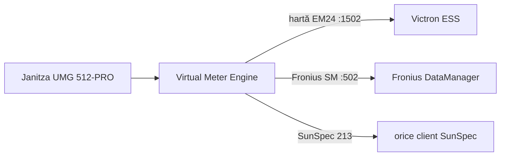
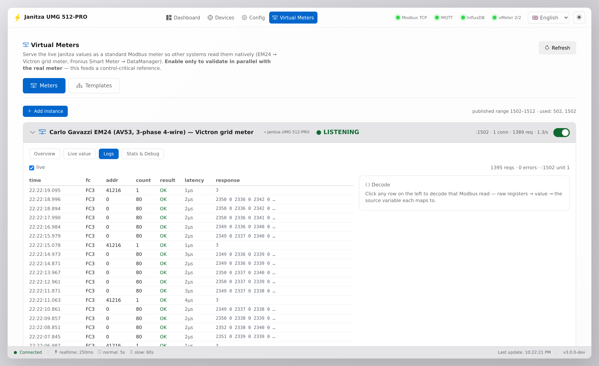
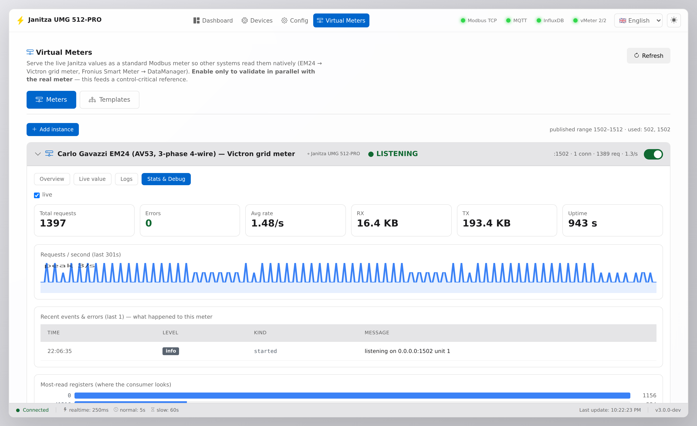
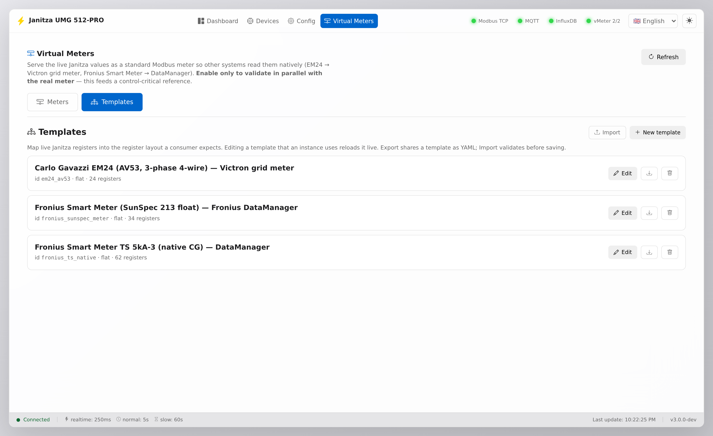

# Multi-Bus Gateway

> fost *Janitza UMG 512-PRO Monitor* — gateway de protocol multi-sursă: Modbus TCP/RTU · HTTP/JSON · MQTT → MQTT / InfluxDB / contoare virtuale Modbus / HTTP-JSON / REST

🇷🇴 **Română** | [🇬🇧 English](README.en.md)

[](https://github.com/sm26449/janitza-monitor/releases)
[](https://github.com/sm26449/janitza-monitor/pkgs/container/janitza-monitor)


[](LICENSE)

> **Gateway Modbus-to-MQTT software — retrofit, nu inlocuire.**

Aduci un analizor de calitate a energiei Janitza UMG existent pe platforme moderne MQTT / IoT — **fara rip-and-replace, fara cutie de gateway dedicata**. Citeste meterul prin Modbus TCP si publica in **MQTT, InfluxDB, Grafana si Home Assistant** — si, unic, re-serveste acel singur meter fizic ca **mai multe device-uri Modbus virtuale** (Carlo Gavazzi EM24, Fronius Smart Meter, SunSpec), astfel incat Victron, Fronius si altele vad fiecare meterul pe care il asteapta. Totul ruleaza intr-un container — *abordarea pentru care producatorii de hardware lanseaza acum aparate dedicate, in software pe care il controlezi tu.*

- 🔌 **Retrofit in loc de inlocuire** — digitalizezi un meter deja instalat; **zero hardware nou**.
- ☁️ **Date Modbus in cloud** — MQTT → InfluxDB, Grafana, Home Assistant autodiscovery.
- 🪞 **Un meter, mai multi consumatori** — servesti un singur device fizic ca mai multe metere Modbus virtuale.
- 🌍 **UI de operator** — multi-limba, monitorizare live, istoric & energie lunara, alerting.


📖 **[Manual de utilizare](docs/MANUAL.ro.md)** · 🔌 **[Ghid Virtual Meter](docs/VIRTUAL-METER.ro.md)**

## De ce software, nu o cutie?

Un aparat Modbus-to-MQTT dedicat e o variantă. Asta e cealaltă: aceeași treabă în software pe care îl deții și îl poți extinde — rulând pe hardware pe care îl ai deja, sau pe un Raspberry Pi de ~50€ cu un adaptor USB/HAT RS-485 (și CAN), montabil pe șină DIN la fel de bine. Fără lock-in de producător, fără cost per cutie.

- ⚡ **Polling sub-secundă configurabil** — reglabil pe fiecare poll-group, fără prag fix (noi rulăm 250 ms pe grupul realtime); gateway-urile cu funcție fixă se opresc de obicei la ~5 s.
- ♾️ **Fără limite de device-uri / valori** — mărginit doar de host, nu o limită fixă de 10 device-uri / 1000 de valori.
- 🪞 **Metere virtuale** — re-servești un singur meter fizic ca mai multe device-uri emulate (Victron, Fronius, SunSpec); un gateway read-only nu poate.
- 🔓 **Open-source, hardware de comodă** — îl inspectezi, îl forkezi, îi adaugi un protocol; îl rulezi pe un Pi.

## Caracteristici

- **Citire Modbus TCP** - Conectare directa la dispozitivul Janitza
- **Publicare MQTT** - Cu suport Home Assistant autodiscovery
- **Publicare InfluxDB** - Pentru stocare time-series
- **🛡️ Zero pierderi la pana InfluxDB** - buffer store-and-forward in RAM (implicit 10 min, configurabil): punctele produse cat timp InfluxDB e picat sunt replay-ate la reconectare **cu timestamp-urile originale** (idempotent - fara duplicate). Punctele sunt stampilate cu ora citirii Modbus, iar citirea Modbus nu depinde de MQTT/InfluxDB - fiecare pipeline reconecteaza independent.
- **Mod "changed"** - Publica doar valorile modificate (reduce traficul)
- **Web UI profesional** - Dashboard, Devices (workspace per dispozitiv), Config, Virtual Meters
- **🌍 Multi-limba (i18n)** - selector EN/RO in UI (implicit English). Limbile sunt fisiere `ui/languages/<cod>.json` descoperite dinamic - copiezi `en.json`, traduci, apare in selector (fara rebuild). Vezi **[ui/languages/README.md](ui/languages/README.md)**.
- **WebSocket real-time** - Actualizari live in UI
- **Hot-reload** - Modificari configuratie fara restart container
- **Configurare flexibila** - Topic-uri MQTT si tags InfluxDB per registru
- **Poll Groups** - Intervale diferite pentru diferite tipuri de date
- **Thresholds** - Color coding pentru valori (warning/danger)
- **Unit Scaling** - Conversie automata Wh→kWh, W→kW, VA→kVA pentru vizualizare clara
- **Gauge Widgets** - Min/max/culoare configurabile cu colorare bazata pe thresholds
- **🔌 Virtual Meters** - Servește un singur Janitza ca **mai multe metere virtuale** (Carlo Gavazzi EM24 pentru Victron, Fronius Smart Meter pentru DataManager, SunSpec…), definite prin template-uri, cu **observabilitate completă** a fiecărui request Modbus. Vezi **[docs/VIRTUAL-METER.ro.md](docs/VIRTUAL-METER.ro.md)**.
- **🧩 Gateway multi-device** - Citește **mai multe surse** — Modbus TCP, Modbus RTU (în lucru), **HTTP/JSON** (ex. un contor Fronius prin Solar API, sau orice endpoint JSON via `json_path` per registru) și **MQTT** (se abonează la un broker și citește valorile din payload-ul JSON sau numere brute, cu topic per registru + wildcard `+`/`#`) — prin **template-uri de dispozitiv** (harta de registre ca fișier portabil, editor + upload + export în UI). Fiecare dispozitiv are **workspace-ul lui cu tab-uri** și **rutare proprie**: prefix de topic MQTT, bucket InfluxDB, ieșiri de metere virtuale și propriul Monitor/History/Energy. Wizard „Add Device" în 3 pași, cu test real de conexiune/citire.
- **🔎 Auto-discovery Modbus** - Scanează un interval din LAN pe portul Modbus (implicit 502) după dispozitive care răspund + sweep de unit-id pe un endpoint; „Use" pre-completează wizard-ul. Scanare read-only, restricționată la LAN.
- **🧮 Măsurători calculate** - Derivă măsurători noi prin formulă (factor de putere, sume pe faze, conversii, dezechilibru, `(E - prev(E)) / dt * 3600` pentru putere din energie) cu un evaluator sigur; curg la **toate** ieșirile ca orice măsurătoare, apar în Monitor și History. Builder cu câmpuri din Measurements + funcții + preview live + preset-uri („salvează ca template propriu").
- **📤 Ieșiri per dispozitiv** - Pe lângă MQTT/InfluxDB/metere virtuale: **HTTP/JSON output** (servește valorile live la `GET /api/meters/<id>`, stil Solar API) și **REST push** (POST periodic de telemetrie JSON către un URL/webhook/cloud, cu headere de auth mascate). Fiecare, opt-in per dispozitiv, în tab-ul Outputs.
- **pv-stack Integration** - Template serviciu pentru Docker Services Manager

## 🔌 Virtual Meters

Un singur UMG 512-PRO la punctul de racord măsoară tot. Dar Victron vrea un
*Carlo Gavazzi EM24*, Fronius vrea un *Fronius Smart Meter*, altul vrea SunSpec.
În loc să cumperi trei metere, le **definești ca template-uri** și le servești pe
toate din meter-ul pe care îl ai deja — fiecare ca server Modbus-TCP izolat,
alimentat din valorile live, cu un **watchdog de prospețime** (sursă stale → nu
mai răspunde, ca fail-safe-ul consumatorului să se activeze).



**Două moduri:** ① rulezi *în paralel* cu meter-ul real ca să validezi fără risc,
apoi ② *consolidezi* — meter-ul virtual îl înlocuiește pe cel fizic. Cu
observabilitate completă (query log) tot drumul.

Plus **observabilitate built-in**: ultimele 1024 query-uri (timp/FC/addr/count/
răspuns/latență), countere, tx/rx, chart req/s — exact instrumentul cu care am
făcut reverse-engineering la protocolul Fronius Smart Meter (vezi case study în doc).

→ **Ghid complet cu diagrame, exemple și cum contribui: [docs/VIRTUAL-METER.ro.md](docs/VIRTUAL-METER.ro.md)**

### Metere compozite (agregator multi-sursă)

Un meter virtual poate acum aduna registre din **mai multe surse deodată** —
Janitza + invertor HTTP + senzori MQTT — într-o singură hartă Modbus TCP și
într-un feed JSON (`/api/virtual-meters/<id>/values`): un PLC/SCADA citește
totul dintr-un singur poll. În editor, sursa unui rând poate fi
`dispozitiv.registru` (grupate pe device în picker), cu prag de prospețime
propriu per rând (un senzor BLE la 60s lângă un rând Janitza la 250ms).

**Convenția de staleness** (absența nu se servește NICIODATĂ ca 0/false —
o valoare înghețată poate conduce greșit o buclă de control):

| Politică (`on_stale`) | Registru stale/lipsă | Folosire |
|---|---|---|
| `legacy` (default) | comportamentul clasic single-source: un singur watchdog pe instanță | meterele existente — neatinse |
| `fail` | citirea care îl atinge → **excepție Modbus**; blocurile peste el sunt refuzate (fără adevăr parțial) | consumatori de control (Victron, PLC) |
| `sentinel` | **N/A SunSpec**: float→NaN, int16→0x8000, uint16→0xFFFF… | consumatori care înțeleg santinelele |
| `hold` | ultima valoare, plafonat la `max_hold_s`, apoi ca `fail` | display-uri tolerante |

Sumele (`sum`) preiau calitatea **celui mai slab** membru — niciodată sume
parțiale. În JSON: `value: null` + `quality: good|stale|missing` + `age_s`,
cu `last_value` separat. Serverul rămâne pornit cât timp cel puțin o sursă
e proaspătă; toate moarte → se oprește (fail-safe-ul consumatorului preia).

## 🧩 Dispozitive & Template-uri de dispozitiv (multi-device)

Harta de registre nu mai este legată de un singur contor: ea trăiește într-un
**template de dispozitiv** — un fișier JSON portabil care descrie un tip de
echipament (registre cu unități de măsură, descrieri, tipuri de date,
categorii, grupuri de poll sugerate și presetări opționale per registru pentru
MQTT/InfluxDB/UI). Janitza UMG 512-PRO vine **inclus** (4.126 de registre în 29
de categorii, cu defaults curatoriate pentru măsurătorile electrice uzuale);
orice alt contor este la un template distanță.

**Config → Devices** arată fiecare contor citit, cu sănătatea live (stare,
rată de poll, vechimea datelor) și rutarea datelor dintr-o privire. **Add
Device** este un wizard în 3 pași:

1. **Conexiune** — Modbus TCP (host/port/unit id, cu buton real de **Test
   connection**: orice răspuns la nivel de protocol, chiar și o excepție
   Modbus, dovedește că dispozitivul e viu) sau Modbus RTU (serial).
2. **Template** — alegi din bibliotecă, **încarci** un fișier (validat rând cu
   rând înainte de a salva ceva) sau **creezi în editor** (metadate + tabel de
   registre cu căutare și validare inline; built-in-urile sunt read-only —
   *Duplicate to edit*; template-urile folosite nu pot fi șterse).
3. **Rutare date** — nume + id de dispozitiv (id-ul este cheia de rutare),
   **prefixul de topic MQTT** cu preview live al unui topic real și **bucket-ul
   InfluxDB** + tag-ul de device. Fiecare dispozitiv publică pe topicurile lui
   și scrie în bucket-ul lui — nu mai există un singur sink global.

Pagina Registers este condusă de template: randează catalogul dispozitivului
pe care îl configurezi, iar fiecare dispozitiv își păstrează selecția proprie
de registre, cu hot-reload doar pe pollerele lui.

**Migrarea este invizibilă**: o instalare existentă cu un singur contor devine
automat „device #1" — aceleași topicuri MQTT byte-cu-byte, același bucket,
aceleași taguri InfluxDB, aceiași identificatori Home Assistant. Nimic din
aval nu observă schimbarea.

Template-urile fac round-trip curat (creezi → exporți → distribui → încarci),
deci hărțile de registre contribuite de comunitate funcționează exact ca
template-urile de metere virtuale și limbile de UI: pui un fișier, fără cod,
fără rebuild.

## Instalare Rapida

### Cu Docker (recomandat)

```bash
# 1. Cloneaza repository
git clone https://github.com/sm26449/janitza-umg512-modbus-mqtt-ui.git
cd janitza-umg512-modbus-mqtt-ui

# 2. Configureaza environment
cp .env.example .env
nano .env  # Editeaza cu valorile tale

# 3. Configureaza registrii (optional - poti face din UI)
cp config/config.example.yaml config/config.yaml
cp config/selected_registers.example.json config/selected_registers.json

# 4. Porneste
docker-compose up -d

# 5. Acceseaza UI
# http://localhost:8080
```

### Rulează imaginea prebuilt (fără build local)

O imagine multi-arch (amd64 + arm64, și pentru Raspberry Pi) este publicată în
GitHub Container Registry la fiecare release. Folosește-o în loc să faci build —
în `docker-compose.yml` înlocuiește `build: .` cu:

```yaml
    image: ghcr.io/sm26449/janitza-monitor:latest
```

…sau rulează direct (porturi: UI + gama virtual-meter + Modbus standard 502):

```bash
docker run -d --name janitza-monitor --restart unless-stopped \
  -p 8080:8080 -p 1502-1512:1502-1512 -p 502:502 \
  --env-file .env -v "$PWD/config:/app/config" \
  ghcr.io/sm26449/janitza-monitor:latest
```

> **Porturi:** `8080` = Web UI · `1502-1512` = metere virtuale (extinde cu
> `VMETER_PORT_START/END`) · `502` = portul Modbus standard pe care unii
> consumatori îl interoghează (scoate-l dacă e ocupat pe host). Ghid: [docs/MANUAL.ro.md](docs/MANUAL.ro.md).

### Cu InfluxDB si Grafana (optional)

```bash
# Porneste cu InfluxDB local
docker-compose --profile influxdb up -d

# Porneste cu Grafana
docker-compose --profile grafana up -d

# Porneste toate
docker-compose --profile influxdb --profile grafana up -d
```

## Configurare

> **Poți configura tot din UI.** Setările de conexiune Modbus, MQTT și InfluxDB sunt editabile live în **Config → Settings** — salvate în `config/config.yaml` (volum montat) și aplicate **fără restart** (fără editări de `docker compose`, fără recreate). Variabilele `.env` / de mediu de mai jos sunt **opționale**: folosește-le doar ca să pre-populezi un deploy nou sau să fixezi valori într-un setup imutabil. O setare dată prin env are întâietate și apare **blocată** în UI; scoate-o din environment ca să poți edita acel câmp din interfață.

### Fisierul .env

Copiaza `.env.example` in `.env` si editeaza:

```bash
# Modbus - Dispozitivul Janitza
MODBUS_HOST=192.168.1.100
MODBUS_PORT=502
MODBUS_UNIT_ID=1

# MQTT
MQTT_ENABLED=true
MQTT_BROKER=mqtt-broker
MQTT_PORT=1883
MQTT_USERNAME=
MQTT_PASSWORD=
MQTT_PREFIX=janitza/umg512
MQTT_PUBLISH_MODE=changed    # "changed" sau "all"

# InfluxDB
INFLUXDB_ENABLED=false
INFLUXDB_URL=http://influxdb:8086
INFLUXDB_TOKEN=your-token
INFLUXDB_ORG=your-org
INFLUXDB_BUCKET=janitza
INFLUXDB_PUBLISH_MODE=changed

# UI
UI_PORT=8080
```

### config/config.yaml

Configuratie YAML (poate fi editata si din UI - Settings):

```yaml
modbus:
  host: 192.168.1.100
  port: 502
  unit_id: 1
  timeout: 3
  retry_attempts: 3

mqtt:
  enabled: true
  broker: mqtt-broker
  port: 1883
  topic_prefix: "janitza/umg512"
  publish_mode: "changed"
  ha_discovery:
    enabled: true
    prefix: "homeassistant"
    device_name: "Janitza UMG 512-PRO"

influxdb:
  enabled: false
  url: "http://influxdb:8086"
  token: "your-token"
  org: "your-org"
  bucket: "janitza"
  publish_mode: "changed"

polling:
  groups:
    realtime:
      interval: 1
      description: "Real-time values"
    normal:
      interval: 5
      description: "Standard measurements"
    slow:
      interval: 60
      description: "Energy counters"
```

> **Nota:** Variabilele ENV au prioritate fata de config.yaml. In UI vei vedea warning cand ENV override-uri sunt active.

### config/selected_registers.json

Registrii selectati pentru monitorizare (se editeaza din UI - Registers):

```json
{
  "version": "1.0",
  "registers": [
    {
      "address": 19000,
      "name": "_G_ULN[0]",
      "label": "Tensiune L1-N",
      "unit": "V",
      "data_type": "float",
      "poll_group": "realtime",
      "mqtt": { "enabled": true, "topic": "voltage/l1_n" },
      "influxdb": { "enabled": true, "measurement": "voltage", "tags": {"phase": "L1"} },
      "ui": { "show_on_dashboard": true, "widget": "value" },
      "thresholds": {
        "enabled": true,
        "dangerLow": 200,
        "warningLow": 210,
        "warningHigh": 245,
        "dangerHigh": 253
      }
    }
  ],
  "poll_groups": {
    "realtime": { "interval": 1 },
    "normal": { "interval": 5 },
    "slow": { "interval": 60 }
  }
}
```

## Web UI

Acceseaza `http://localhost:8080`

UI-ul e organizat în patru zone principale — **Dashboard** (global), **Devices**, **Config** și **Virtual Meters**. Tot ce ține de un singur contor (Monitor, History, Energy, harta lui de registre) stă în workspace-ul acelui dispozitiv, nu într-un meniu global.

### Dashboard

Vizualizare live a tuturor registrilor selectati cu widgets (value, gauge, chart), color coding bazat pe thresholds si view Cards/Table.


### Devices

Pagina centrală a gateway-ului: fiecare sursă configurată — Modbus TCP, Modbus RTU (în lucru) sau **HTTP/JSON** — ca un card cu status-ul conexiunii live, protocol, număr de registre și ieșirile activate. Un **wizard „Add Device" în 3 pași** (identitate → protocol/conexiune → template, cu test real de conexiune/citire) creează dispozitive noi. Dispozitivul #1 (Janitza) e un dispozitiv normal aici, cu identitatea de topic/bucket blocată.


### Workspace-ul dispozitivului

Deschiderea unui dispozitiv oferă un **workspace cu tab-uri**, nu un perete de formulare. Se deschide pe **Overview** — un rezumat read-only: starea conexiunii, sursa, template-ul, numărul de registre, rata efectivă de poll și status-ul fiecărei ieșiri (prefix topic MQTT, bucket InfluxDB) cu prospețimea datelor. Tot aici apare first-class o pierdere de comunicație (ultima citire reușită, vechimea per poll-group, evenimente recente de eșec) — același semnal expus pe `/health` și publicat pe MQTT la `<prefix>/data_health` pentru alertare externă.


**Edit** conține tot ce modifici: conexiunea (host/port sau URL), template-ul, intervalele per poll-group și toggle-urile de ieșire MQTT / InfluxDB. Modificările se aplică prin hot-reload — dispozitivul se reconectează fără restart de container.


**Registers** e editorul hărții de registre per dispozitiv: un tab **Available** (răsfoiește/caută în catalogul complet — 4126 pentru Janitza) și un tab **Selected** (ce se citește, cu poll group, widget, MQTT topic, InfluxDB measurement și thresholds per registru). Poți adăuga un **registru custom** manual și **încărca / descărca** toată harta ca fișier template portabil.


**Add register** — adăugare la monitorizare cu configurare completă: poll group, widget, tip date, MQTT topic, InfluxDB measurement, scale, thresholds (și un `json_path` pentru dispozitivele HTTP/JSON).


### Monitor · History · Energy (per dispozitiv)

Aceste trei vederi se accesează **din workspace-ul unui dispozitiv** și sunt condiționate de ieșirile lui: **Monitor** are nevoie de polling activat, iar **History** și **Energy** de ieșirea InfluxDB activată (citesc datele stocate înapoi).

**Monitor** — grafic real-time cu multiple registre suprapuse. Drag & drop din sidebar, zoom/pan, statistici min/max/avg.


**History** — citește datele stocate **înapoi** din InfluxDB. Alegi registri dintr-o listă căutabilă, grupată pe categorii (punctul colorat se potrivește cu linia lui), alegi intervalul și rezoluția, și obții linii medii pe axă Y comună, cu bandă min/max (un singur registru) și un crosshair la hover cu tooltip ce listează valoarea fiecărei serii la momentul cel mai apropiat.


**Energy** — contabilitate de energie lunară din InfluxDB: alegi o lună și vezi totalurile — **consum (import)**, **injecție (export)**, energie **reactivă** și **aparentă** (delta contoarelor cumulative pe lună) — plus o defalcare zilnică import vs export.


### Config

Doar setări globale: broker **MQTT**, conexiune **InfluxDB**, **Backup** și **Security**. Rutarea per dispozitiv (prefix topic, bucket) stă la dispozitiv, nu aici. Hot-reload cu "Apply Configuration" reconectează fără restart; ENV overrides active sunt semnalate.


### Virtual Meters

Servește valorile live ca metere Modbus standard pentru alte sisteme. Fiecare meter e un card acordeon (status, valori live, conexiuni IP:port) cu subtab-uri per meter **Overview / Live / Logs / Stats & Debug**, plus un tab **Templates** (editor + import/export YAML) și un buton **Add instance**. Fiecare instanță își numește **dispozitivul sursă**. Ghid complet: **[docs/VIRTUAL-METER.ro.md](docs/VIRTUAL-METER.ro.md)**.


**Logs** - jurnal live al ultimelor 1024 cereri Modbus (timp, function code, adresă, count, OK/excepție, latență, răspuns) — exact ce citește consumatorul.



**Stats & Debug** - countere (cereri/erori/rate/RX/TX/uptime), chart cereri/secundă și registrele cele mai citite.



**Templates** — definește harta de registre a unui meter emulat (sau o import/export ca YAML); profilurile de ieșire se leagă de nume canonice de registre-sursă, deci același template funcționează pe orice dispozitiv sursă.



**Editor de template** — editezi maparea registrelor unui profil (adresă, registru sursă sau un `sum` de mai multe, scale) cu validare live.


## API Endpoints

| Endpoint | Metoda | Descriere |
|----------|--------|-----------|
| `/` | GET | Web UI |
| `/api/status` | GET | Status sistem (Modbus, MQTT, InfluxDB) |
| `/api/config` | GET | Configuratie curenta |
| `/api/registers/all` | GET | Toti registrii disponibili |
| `/api/registers/selected` | GET/POST | Registrii monitorizati |
| `/api/values` | GET | Valori curente |
| `/api/values/{address}` | GET | Valoare pentru adresa specifica |
| `/api/query/register` | POST | Query on-demand |
| `/api/query/batch` | POST | Query batch |
| `/api/search?q=...` | GET | Cauta registri |
| `/api/config/modbus` | GET/POST | Config Modbus |
| `/api/config/mqtt` | GET/POST | Config MQTT |
| `/api/config/influxdb` | GET/POST | Config InfluxDB |
| `/api/config/apply` | POST | Aplica configuratie (reconnect) |
| `/api/config/reload-registers` | POST | Reload registri |
| `/api/languages` | GET | Limbi UI disponibile (scaneaza `ui/languages/`) |
| `/api/languages/{cod}` | GET | Traducerile unei limbi |
| `/api/history` | GET | Istoric stocat pentru un registru (InfluxDB) |
| `/api/history/registers` | GET | Registrii disponibili pentru istoric |
| `/api/energy/monthly` | GET | Totaluri energie lunare + defalcare zilnica |
| `/ws` | WebSocket | Stream real-time |

## Home Assistant Integration

Cu `ha_discovery.enabled: true`, senzori se creeaza automat in Home Assistant.

Topic-uri MQTT:
- `janitza/umg512/voltage/l1_n` - valoare registru
- `janitza/umg512/status` - online/offline
- `homeassistant/sensor/janitza/...` - autodiscovery configs

## Publish Mode: changed vs all

| Mode | Descriere | Use case |
|------|-----------|----------|
| `changed` | Publica doar cand valoarea se schimba | Reduce trafic, ideal pentru MQTT |
| `all` | Publica toate citirile | Necesar pentru time-series complete |

In UI statusul "Skipped" arata cate mesaje nu au fost publicate (valori neschimbate).

## Structura Proiect

```
janitza-umg512-modbus-mqtt-ui/
├── config/                    # Fisiere configurare
│   ├── config.example.yaml
│   └── selected_registers.example.json
├── docs/                      # Documentatie Modbus
│   ├── modbus_data.json      # 4126 registri structurati
│   └── extract_pdf.py        # Script extractie din PDF
├── janitza/                   # Pachet Python
│   ├── __init__.py
│   ├── config.py             # Loader configuratie
│   ├── modbus_client.py      # Client Modbus TCP
│   ├── mqtt_publisher.py     # Publisher MQTT
│   ├── influxdb_publisher.py # Publisher InfluxDB
│   ├── register_parser.py    # Parser tipuri date
│   └── api.py                # REST API + WebSocket
├── ui/                        # Frontend
│   ├── templates/
│   │   ├── index.html
│   │   ├── base.html
│   │   └── partials/
│   ├── css/
│   │   ├── base.css
│   │   ├── dashboard.css
│   │   ├── monitor.css
│   │   ├── registers.css
│   │   └── config.css
│   └── js/
│       └── app.js
├── main.py                    # Entry point
├── requirements.txt
├── Dockerfile
├── docker-compose.yml
├── .env.example               # Template environment
├── CHANGELOG.md
└── README.md
```

## Adrese Frecvent Utilizate

| Adresa | Nume | Unitate | Descriere |
|--------|------|---------|-----------|
| 19000 | _G_ULN[0] | V | Tensiune L1-N |
| 19002 | _G_ULN[1] | V | Tensiune L2-N |
| 19004 | _G_ULN[2] | V | Tensiune L3-N |
| 19006 | _G_ULL[0] | V | Tensiune L1-L2 |
| 19008 | _G_ULL[1] | V | Tensiune L2-L3 |
| 19010 | _G_ULL[2] | V | Tensiune L3-L1 |
| 19012 | _G_ILN[0] | A | Curent L1 |
| 19014 | _G_ILN[1] | A | Curent L2 |
| 19016 | _G_ILN[2] | A | Curent L3 |
| 19026 | _G_P_SUM3 | W | Putere activa totala |
| 19034 | _G_S_SUM3 | VA | Putere aparenta totala |
| 19042 | _G_Q_SUM3 | var | Putere reactiva totala |
| 19050 | _G_FREQ | Hz | Frecventa |
| 19052 | _G_COSPHI | - | Factor putere |
| 19060 | _G_WH_SUML13 | Wh | Energie activa totala |

Vezi `docs/modbus_data.json` pentru lista completa cu 4126 registri.

## Integrare pv-stack (Docker Services Manager)

Pentru deploy in stack-ul pv-stack cu mosquitto si influxdb partajate:

```bash
# Copiaza fisierele in templates
cp -r janitza-umg512-modbus-mqtt-ui/* docker-setup/templates/janitza-monitor/

# Deploy prin docker-compose
docker compose -f docker-compose.pv-stack.yml build janitza-monitor
docker compose -f docker-compose.pv-stack.yml up -d janitza-monitor
```

Variabilele de mediu sunt **fara prefix** (aplicatia citeste `MODBUS_HOST`, nu
`JANITZA_MODBUS_HOST`) si toate sunt **optionale** — de preferat le setezi din UI.
`API_KEY` e acceptat si ca `JANITZA_API_KEY`.

```bash
MODBUS_HOST=192.168.1.100
MQTT_BROKER=mosquitto
INFLUXDB_ENABLED=true
INFLUXDB_URL=http://influxdb:8086
INFLUXDB_BUCKET=janitza
UI_PORT=8080
```

Vezi `service.yaml` pentru lista completa de variabile si dependinte.

## Dezvoltare

```bash
# Cloneaza
git clone https://github.com/sm26449/janitza-umg512-modbus-mqtt-ui.git
cd janitza-umg512-modbus-mqtt-ui

# Virtual environment
python3 -m venv venv
source venv/bin/activate

# Instaleaza dependente
pip install -r requirements.txt

# Ruleaza local
python main.py --debug

# Rebuild Docker
docker-compose up --build -d

# Vezi logs
docker-compose logs -f
```

## Troubleshooting

### Modbus nu se conecteaza
- Verifica IP-ul dispozitivului Janitza
- Asigura-te ca portul 502 este accesibil
- Verifica Unit ID (default: 1)

### MQTT nu publica
- Verifica broker-ul este accesibil
- Verifica username/password
- Check logs: `docker-compose logs -f | grep MQTT`

### InfluxDB skipped messages
- Normal pentru `publish_mode: changed` - valori neschimbate nu se scriu
- Schimba la `publish_mode: all` daca vrei toate datele

### ENV override warning in UI
- Variabilele ENV au prioritate fata de config.yaml
- Sterge variabila din .env daca vrei sa folosesti valoarea din UI

## Securitate

Interfata web si API-ul REST sunt **fara autentificare** — inclusiv endpoint-urile
de control (activare/dezactivare contoare virtuale, editare config). Un contor
virtual poate alimenta o bucla de control (ESS / limitare export), deci trateaza
acest dispozitiv ca pe unul de **LAN de incredere**:

- Ruleaza-l pe un **LAN privat/de management**, neexpus la internet.
- Daca ai nevoie de acces remote, pune-l **in spatele unui reverse proxy cu auth**
  (sau VPN). Nu face port-forward la 8080 / porturile contoarelor.
- Contoarele virtuale asculta pe `0.0.0.0` implicit — restrictioneaza la nivel de retea.

**Cheie de scriere optionala.** Seteaza `API_KEY` (env) ca sa ceri un header `X-API-Key`
la fiecare cerere care modifica starea (POST/PUT/PATCH/DELETE); telemetria read-only
(GET) si interogarile la cerere raman deschise. UI-ul cere cheia o data si o retine.
Lasa gol (implicit) pentru un appliance complet deschis pe LAN de incredere. E aparare
in adancime — nu inlocuieste tinerea portului 8080 in afara retelelor nedemne de incredere.

## Contributing

Found a bug or have a feature request? Please open an issue on [GitHub Issues](https://github.com/sm26449/janitza-umg512-modbus-mqtt-ui/issues).

## Authors

**Stefan M** - [sm26449@diysolar.ro](mailto:sm26449@diysolar.ro)

**Claude** (Anthropic) - Pair programming partner

## License

**PolyForm Noncommercial License 1.0.0** — free for personal and other
**noncommercial** use; commercial use requires a separate license.

Copyright (c) 2024-2026 Stefan M <sm26449@diysolar.ro>

You may use, copy, modify, and share this software **for any noncommercial
purpose** — personal, hobby, research, education, or non-profit. **Commercial
use is not permitted** under this license; contact the author for a commercial
license. Full terms in [LICENSE](LICENSE) ·
<https://polyformproject.org/licenses/noncommercial/1.0.0/>

---

**Disclaimer**: This software is provided "as is", without warranty of any kind. Use at your own risk when monitoring critical energy systems.
