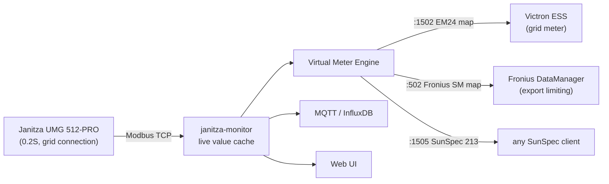
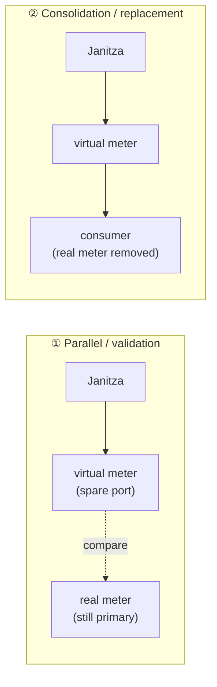
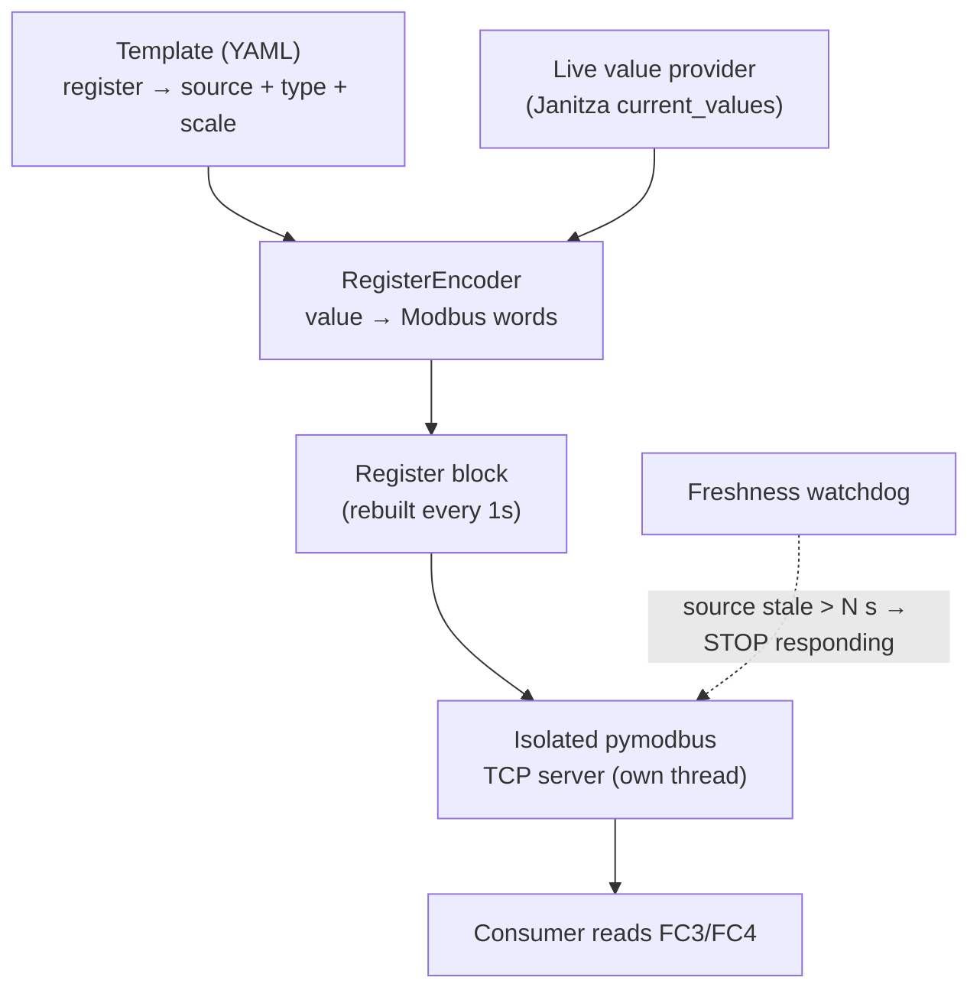
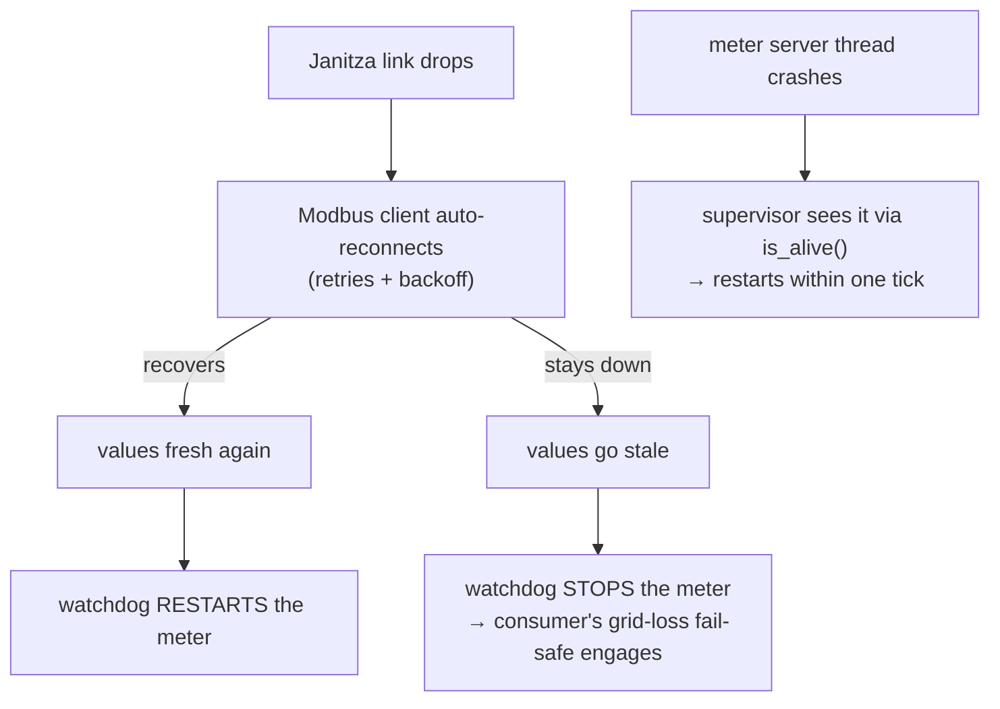
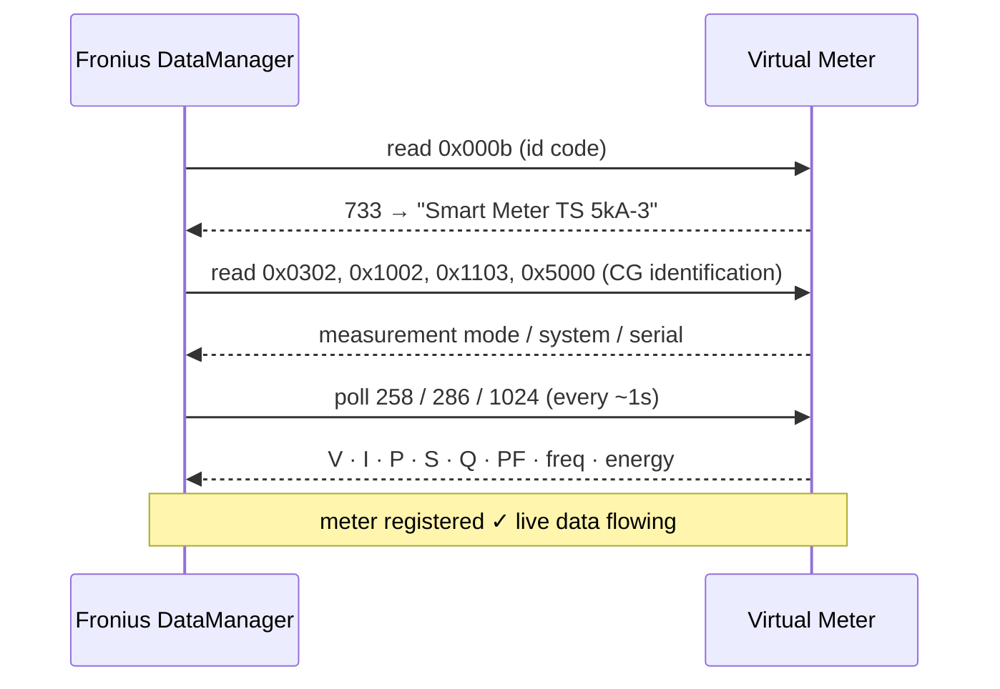

# Virtual Meter Engine

🇬🇧 **English** | [🇷🇴 Română](VIRTUAL-METER.ro.md)

> Turn **one** physical power-quality analyzer into **many** virtual meters —
> each one speaking the exact Modbus dialect a consumer expects — with full,
> built-in observability of every request.

One Janitza UMG 512-PRO sits at your grid connection point. It already measures
everything: per-phase voltage, current, power, power factor, frequency, energy.
Meanwhile your Victron ESS wants a *Carlo Gavazzi EM24*, your Fronius inverter
wants a *Fronius Smart Meter*, and a third system wants plain SunSpec. Normally
you'd buy three meters. **Here you define them as templates and serve them all
from the one meter you already have.**



Each virtual meter is an **isolated Modbus-TCP server** fed from a **source
device's** live values — the Janitza by default, but any device the gateway polls
— so a UI/MQTT hiccup never interrupts metering. A meter is just a **YAML
template** (a register map + source bindings) — adding a new one needs no code.
Because output profiles bind to canonical register **names**, the same template
serves off any source device that exposes those names.

---

## Two ways to run it



**① Parallel (validation)** — run the virtual meter on a spare port *next to* the
real meter, point a test consumer (or just the **Logs** tab) at it, and compare.
Nothing control-critical depends on it yet. This is how you build confidence and
reverse-engineer a new consumer — risk-free.

**② Consolidation (replacement)** — once validated, the virtual meter becomes the
consumer's meter and the dedicated physical meter is removed. **One Janitza now
serves every consumer** (Victron grid meter + Fronius export limiting + …). This
is the end state: fewer boxes, one source of truth, the freshness watchdog as the
safety net.

> Always go ①→② on a meter that feeds a control loop. Never wire a brand-new
> virtual meter straight into ESS/export limiting without the parallel check.

---

## How it works



1. **Template** declares each register: address, type (`int16`/`uint32`/`float`/
   `string`…), scale, byte order, and where its value comes from — a **live**
   register of the meter's **source device** (the Janitza by default), a
   **constant**, or a **sum** of several live registers.
2. The **engine** resolves the template against the live cache and encodes every
   value into Modbus words, rebuilding the register block once per second.
3. Each enabled instance runs its **own pymodbus TCP server in its own thread**.
4. A **freshness watchdog** is the safety core: if the Janitza source goes stale
   (> `stale_after_s`), the server **stops responding** so the consumer's own
   grid-meter-loss fail-safe engages — we never feed silently-stale data into a
   control loop. Multi-register values are written atomically (no word-tearing).

---

## Reliability & uptime

A virtual meter can sit in a control loop (Victron ESS, Fronius export limiting),
so the engine is built to **self-heal and fail safe** — never to feed bad data.



Four independent guards, each running on its own:

1. **Source reconnect** — the Janitza Modbus client reconnects automatically on
   a dropped socket (retry attempts + delay), so a transient network blip
   doesn't take the data offline.
2. **Freshness watchdog** — if values go stale beyond `stale_after_s`, the meter
   **stops responding** rather than serving a frozen value. The consumer then
   engages its own grid-meter-loss fail-safe. Stale-but-served is the one thing
   we never do.
3. **Crash recovery** — each meter runs an isolated daemon thread with its own
   asyncio loop; a supervisor checks the actual thread health (`is_alive()`, not
   just a flag) every tick and restarts a dead server, with backoff if a port is
   briefly held. The supervisor body is fully guarded so it can never die.
4. **Consumer reconnect** — when a meter comes back, the consumer reconnects to
   the TCP server normally; pymodbus accepts the new connection.

**No data loss:** the live cache always holds the latest reading; the engine
serves the freshest value or fails safe — it never serves stale. (The monitor's
backfill can also self-heal InfluxDB gaps from the meter's onboard recording.)

**Cost of observability:** one in-RAM `deque` append per read (latency measured
in single-digit microseconds) — it never touches the serving path's correctness
because every stats call is exception-guarded.

---

## Observability — see exactly what your consumer reads

Every read a consumer issues is recorded in RAM (no setup, no persistence):
the **last 1024 queries** with address, count, response sample, latency and
error flag, plus live counters and a per-second request-rate chart.

This is not a side feature — **it is the tool that let us reverse-engineer the
Fronius Smart Meter protocol** (see the case study below), now built into the UI.

The **Virtual Meters** page has two page-level tabs — **Meters** and **Templates**
— plus an **Add instance** button. Meters is a list of **accordion cards**, one
per instance: the header shows its name, **source device** (the `← Janitza UMG
512-PRO` chip — the device whose live values feed it), serving state
(`LISTENING` / `STALE` / `DOWN`), port, connection count, request count and rate,
and an enable toggle. Expand a card for four **subtabs**:

| Subtab | What you get |
|--------|--------------|
| **Overview** | served state, source device, port/unit, freshness, register count, edit / delete |
| **Live value** | the live values currently served, register by register |
| **Logs** | live table of the last queries — `time · FC · addr · count · OK/EXC · latency · response` · **click any row to decode it in a side panel** |
| **Stats & Debug** | total / errors / req-rate / RX / TX / uptime · **requests-per-second chart** · **recent events & errors** · most-read registers |

A real query-log line looks like:

```
20:44:57.102   FC3   addr 0    count 80   OK    6µs   2343 0 2334 0 2337 0 …
20:44:57.113   FC3   addr 41216 count 1   OK    6µs   3
```

**Meters** — each instance is an accordion card with its source-device chip, live status and served values:


**Logs + decode** — every read the consumer issues, live (this is how the Fronius map was found). Click any row and it decodes in a **side panel** to the right of the table (the row stays highlighted): the panel walks the requested block against the template and shows, per register, `addr` (dec + hex) · the bound `source / variable` (e.g. `_G_ULN[0]`, `_PLN[0]`, `const 1651`) · data type · raw words · decoded value. It's the fastest way to confirm a map is correct — you read the same bytes the consumer reads, already labelled:


**Stats & Debug** — counters, requests-per-second chart, the registers the consumer reads most, and **recent events & errors**: the engine keeps the last 50 lifecycle events per meter in RAM — `started`, `crash` (server thread died → auto-restart), `restart_failed`, `wedged` (alive but not accepting connections → force-restart), `stopped` (source went stale → meter stops responding as a consumer fail-safe), `supervise` errors. So when a consumer reports a dropout you see *why* the meter went quiet, not just *that* it did. The most recent error/warn is also published on MQTT (`…/vmeter/<id>/state` → `last_error`), so [alertd](#monitoring-via-mqtt-eg-alertd) can rule on it.


### API

| Endpoint | Purpose |
|----------|---------|
| `GET /health` | meter-aware health (see below) — 200 ok/degraded, 503 down |
| `GET /api/virtual-meters` | instances + live status + served values |
| `GET /api/virtual-meters/{id}/stats?limit=N` | query log + counters + rate + per-register |
| `GET /api/virtual-meters/template/{id}/export` | template YAML (download) |
| `POST /api/virtual-meters/templates/import` | import a template YAML (validated before save) |
| `PUT /api/virtual-meters/template/{id}` | create / edit a template |
| `POST /api/virtual-meters/{id}/toggle?on=true` | enable / disable an instance |

### Health endpoint (container probe + monitors)

`GET /health` reports the aggregate state of the **enabled** meters and is what
the Docker `HEALTHCHECK` probes:

```json
{ "status": "ok", "enabled_meters": 2, "meters": [
  { "id": "em24_av53", "state": "ok",    "freshness_age_s": 1.3, "port": 1502, "last_error": null },
  { "id": "fronius_ts_native", "state": "ok", "freshness_age_s": 1.3, "port": 502, "last_error": null } ] }
```

Per meter: `ok` (serving + fresh) · `stale` (serving but the source went stale →
the meter correctly stops responding, a consumer fail-safe) · `down` (enabled but
not serving = a genuine fault). The HTTP code is **200 for ok and degraded**, and
**503 only when a meter is `down`** — a stale source is expected and a restart
would not fix it, whereas a `down` meter (crashed / failed to start) is a real
fault a container restart might clear. This is deliberate: the healthcheck reflects
the *meters*, not just "is the web server up".

### Monitoring via MQTT (e.g. alertd / Home Assistant)

Every ~10 s each meter's full state is published **retained** to
`<MQTT_PREFIX>/vmeter/<id>/state` (e.g. `janitza/umg512/vmeter/fronius_ts_native/state`) —
the complete picture for monitoring, with **no electrical data duplicated**:

```json
{ "id": "fronius_ts_native", "name": "Fronius Smart Meter TS 5kA-3 (native CG)",
  "bind": "0.0.0.0", "port": 502, "unit_id": 1, "registers": 62,
  "enabled": true, "running": true, "state": "ok",
  "connections": [ { "ip": "192.168.1.241", "port": 45098, "connected_s": 4213 } ], "conn_count": 1,
  "requests": 84213, "req_rate": 2.1, "errors": 0,
  "bytes_rx": 4392, "bytes_tx": 21716,
  "last_fresh": "2026-06-18T22:29:17", "freshness_age_s": 1.6, "uptime_s": 198,
  "last_error": null, "ts": 1781821757 }
```

`state` is `ok` / `stale` / `down`. `connections` lists each live client by `ip`/`port`
(who is reading the meter — your Victron / DataManager). Point any monitor at it —
e.g. an **alertd** variable with `json_path: state`, and rules like:

- `state != "ok"` while enabled → the meter stopped serving (source stale or crashed) — page the operator.
- `var_age() > 60` → the publisher itself is down (monitor crashed) — the `ts` field / retained age makes this trivial.
- `errors` rising → the consumer is hitting illegal-address reads (map mismatch).
- `last_error` non-null → inspect the most recent lifecycle event (crash / restart / stale) without opening the UI.

**Home Assistant autodiscovery** — if `MQTT_HA_DISCOVERY=true`, each virtual meter
is auto-published as an HA **device** (linked to the Janitza via `via_device`) with
entities: `serving` (connectivity), `state`, `req/s`, `requests`, `errors`,
`connections`, `data age`, `uptime`, `last error`. They appear in HA with zero
manual configuration — build dashboards or automations on them directly.

---

## Performance & latency

Benchmarked on the reference setup (reading the 16-register summary block):

| Path | Throughput | Latency p50 / p99 |
|------|-----------|-------------------|
| Single client, over the LAN | **~10,000 req/s** | ~94 µs / ~189 µs |
| Single client, loopback (pymodbus) | ~8,000 req/s | ~120 µs / ~200 µs |
| 6 concurrent clients, loopback | **~11,600 req/s** aggregate | — |

The server is **never the bottleneck** — it answers tens of thousands of reads
per second at sub-millisecond latency, far beyond any real meter consumer.

**But fast reads ≠ fresh data.** The pipeline:

```
Janitza poll (realtime group ~1s) → live cache → block rebuilt every
update_interval_s (1s) → answered in ~100 µs
```

Served values refresh **about once per second** (the Janitza realtime poll + the
1 s block rebuild), so end-to-end data age is ≤ ~2 s (typically ~1 s). **Polling
faster than ~1 Hz returns the same value** — a µs-fast response, but not newer
data. The virtual layer itself adds only **microseconds**; the ~1 s is the
meter's own measurement cadence.

To trade load for freshness, lower `update_interval_s` (per instance) *and* the
realtime poll-group interval — but the UMG512's realtime values are already ~1 s
and faster polling loads the physical meter. For grid-power into a control loop,
~1 s is what the meter provides.

---

## Templates

A template is a register map. Anatomy:

```yaml
template:
  id: em24_av53                       # filename-safe id
  name: "Carlo Gavazzi EM24 — Victron grid meter"
  byte_order: little                  # EM24 is low-word-first (Reg_s32l)
  transport: { type: tcp, port: 1502, unit_id: 1, bind: "0.0.0.0" }
  registers:
    - { addr: 0x000b, type: uint16, source: { const: 1651 } }            # model id
    - { addr: 0x0028, type: int32, scale: 10, source: { live: "_G_P_SUM3" } }   # total power
    - { addr: 0x0000, type: int32, scale: 10, source: { live: "_G_ULN[0]" } }   # V L1
```

Source kinds: `{ live: "_NAME" }` (a Janitza register), `{ const: N }`,
`{ const_str: "TEXT" }`, `{ sum: ["_A","_B","_C"] }` (sum of live registers).

Shipped templates:

| Template | Emulates | Consumer | Notes |
|----------|----------|----------|-------|
| `em24_av53` | Carlo Gavazzi EM24 (AV53, 3-phase) | Victron Venus ESS | proven in production |
| `fronius_ts_native` | Fronius Smart Meter TS 5kA-3 (native CG map) | Fronius Symo DataManager | see case study |
| `fronius_sunspec_meter` | Generic SunSpec model 213 (3-phase, float) | any SunSpec-TCP client | clean SunSpec example |

Define your own in the **Templates** tab (editor with per-row validation + YAML
import/export), or import a `.yaml` someone shared:


When you **Add instance**, you pick the template, the port/unit, and the **source
device** that feeds it (defaults to the Janitza) — so the same EM24 or Fronius
profile can serve off any device the gateway polls.

---

## Case study — emulating a Fronius Smart Meter

The Victron path (EM24) is well documented. The Fronius path was not — and the
journey is the best illustration of what this tool is for.

A Fronius **Smart Meter TS** is a rebadged **Carlo Gavazzi** meter. A Symo
DataManager does **not** read it over SunSpec — it uses **proprietary CG/Fronius
registers** for identification and the **native `258` / `286` / `1024` blocks**
for data. We found this by serving a candidate map, then **watching the Logs tab**
to see exactly which registers the DataManager requested and in what order:



What the query log made obvious (and what tripped us up first):

- The DM **probes proprietary registers** (`0x000b`=733, `0x0300`, `0x06aa`) and
  expects **values, not zeros and not Modbus exceptions** — a generic SunSpec
  meter that excepts there is rejected.
- The **data lives in the native CG blocks** `258`/`286`/`1024`, **not** SunSpec
  `40071`. Reactive energy is split `kVArh`/`VArh` across the block.
- The DM polls live data ~**1×/second** and energy ~**1×/10 s** — visible
  directly in the Stats chart.

The result: a Janitza-fed virtual meter that a real Fronius DataManager accepts
as a `Smart Meter TS 5kA-3` with complete, live, correct data. Full register
mapping is documented inline in [`config/templates/fronius_ts_native.yaml`](../config/templates/fronius_ts_native.yaml).

> ⚠️ **Fronius: PRIMARY meter only.** The DataManager reads its **primary** Smart
> Meter over this native Carlo Gavazzi map — that's the path this template
> emulates, so add it as the **primary** meter. It does **not** work as a
> *secondary* meter: the DataManager won't let a secondary meter take Modbus
> address **240** (it collides with the primary's address), so you'd have to
> re-address the existing meter first. In practice: use it to **replace** the
> primary Smart Meter, not to add a second one.

---

## Tested hardware

Verified end-to-end against real equipment:

| Role | Hardware | Template / result |
|------|----------|-------------------|
| **Source meter** | Janitza **UMG 512-PRO** (class 0.2S power-quality analyzer) | the one physical meter feeding everything |
| **Victron ESS** | Victron Venus OS (Ekrano GX) | `em24_av53` — accepted as a Carlo Gavazzi **EM24** grid meter (in production) |
| **Fronius** | Fronius **Symo** + **DataManager 2.0** (FW `3.34.1-5`, HW `2.6D`) | `fronius_ts_native` — accepted as a **Smart Meter TS 5kA-3** *primary* grid meter, full live data |
| **Any SunSpec client** | — | `fronius_sunspec_meter` — generic SunSpec 213 example |

Stack: Docker · Python + pymodbus · Mosquitto (MQTT) · InfluxDB. Other Carlo
Gavazzi / SunSpec consumers should work with the matching template — reports and
new templates welcome (see Contributing).

> 🙏 **Got a Fronius GEN24?** We couldn't test one. Unlike the Symo + DataManager 2.0
> (which needs the native CG map), GEN24 firmware *does* support a Modbus-TCP
> **SunSpec** meter — so `fronius_sunspec_meter` is likely the right template
> there. If you have a GEN24: add that template on a spare port, point the
> inverter's meter at it, watch the **Logs** tab to see what it reads, and please
> open an issue/PR with the result. That's the one consumer we can't verify
> ourselves — community help closes it.

## Gotchas & lessons learned

Hard-won notes from getting real consumers to accept these meters — they'll save you hours.

**Fronius DataManager**
- It identifies its Smart Meter via the **native Carlo Gavazzi map, not SunSpec**. A clean SunSpec-213 meter is read but **rejected** ("Timeout, meter not detected"). Use `fronius_ts_native`, not a SunSpec template.
- Identity comes from proprietary registers (FRONIUS id code `733` @`0x000b`, measurement mode @`0x0302`, …); the live data is in the **native blocks 258 / 286 / 1024**, NOT SunSpec `40071`.
- **Primary meter only** — a *secondary* meter can't take Modbus address **240** (collides with the primary), so use the virtual meter to **replace** the primary, not to add a second one.
- The DM shows **serial / CT ratio / VT ratio as 0/None** for an emulated meter (it caches identity per meter-id and reads them from registers we couldn't pin) — **cosmetic**, every measurement is correct.

**Victron / Carlo Gavazzi EM24**
- Data is **little-word-first** (`Reg_s32l`: low 16-bit word at the lower address). Wrong word order → garbage / inverted values.
- Victron detects the model from register **`0x000b`** (`1651` for the EM24 AV53) — get it right or it isn't recognized.
- The **A-total must be the arithmetic sum of the phase currents**, not the vector/neutral sum (~0) — an A inconsistent with W gets the meter rejected.

**Energy registers** — active and reactive energy are **split**: a kWh/kVArh part (leave 0) + a Wh/VArh part. Put the full value in the **Wh/VArh** slot, or the consumer reads it ×1000.

**General**
- A virtual meter is **control-critical** — always run it ① *parallel* to the real meter and watch the **Logs** tab before ② cutting over.
- Watching the consumer's reads live (Logs tab) is how every one of these maps was figured out.
- After a UI update, hard-refresh once (the JS bundle is cache-busted, but proxies can cache).

---

## Quick start

```bash
# 1. publish a port range for the meters (docker-compose), e.g. 1502-1512 (+ 502)
# 2. drop a template in config/templates/   (or use the UI editor)
# 3. add an instance:
curl -X POST localhost:8080/api/virtual-meters \
     -H 'Content-Type: application/json' \
     -d '{"template":"em24_av53","port":1502,"unit_id":1,"enabled":false}'
# 4. validate IN PARALLEL with the real meter, then enable + point the consumer here
```

> ⚠️ **A virtual meter can feed a control loop** (ESS, export limiting). Always
> validate in parallel against the real meter first, confirm the consumer's
> grid-loss fail-safe, and only then cut over. The freshness watchdog is your
> safety net, not a substitute for validation.

---

## Contributing — add a meter, grow the project

The whole point of templates is that **a new meter is data, not code**. If you
have a consumer that wants a meter we don't ship yet:

1. Add a template in `config/templates/<your_meter>.yaml`.
2. Enable it on a spare port, point the consumer at it.
3. Open the **Logs** tab and watch what the consumer reads — adjust the map until
   it's happy. (This is exactly how `fronius_ts_native` was built.)
4. Export the template and open a PR with it + a note on the consumer + firmware.

Ideas we'd love help with: more Carlo Gavazzi / SunSpec / Schneider / Eastron
maps, a per-register "diff vs real meter" view, optional persistence of the query
log, and packaging the engine as a standalone service.

Issues and PRs welcome — the engine is small, isolated, and well-commented.
