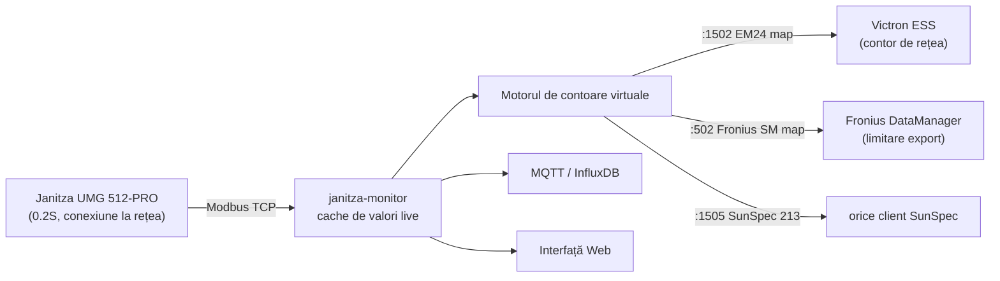
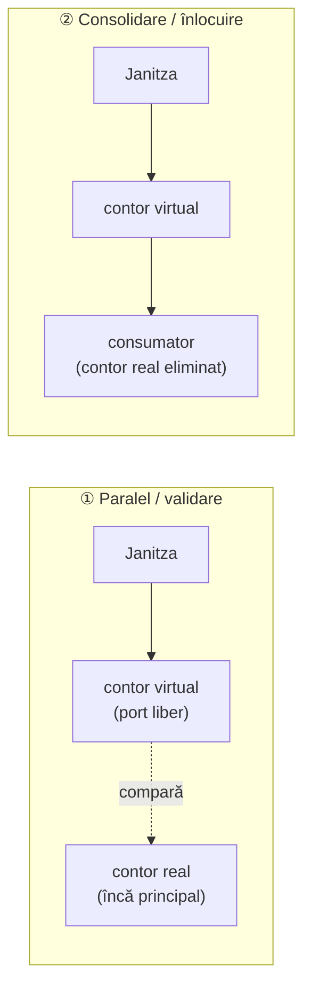
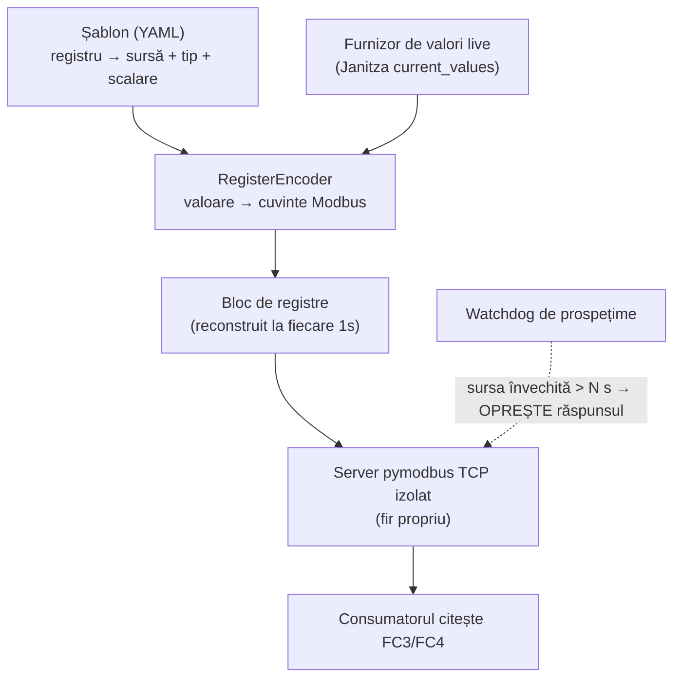
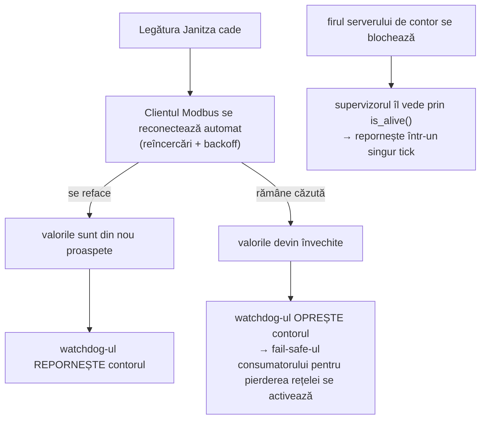
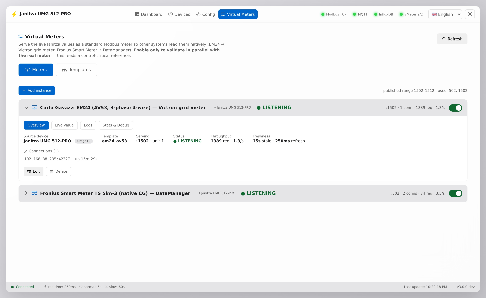
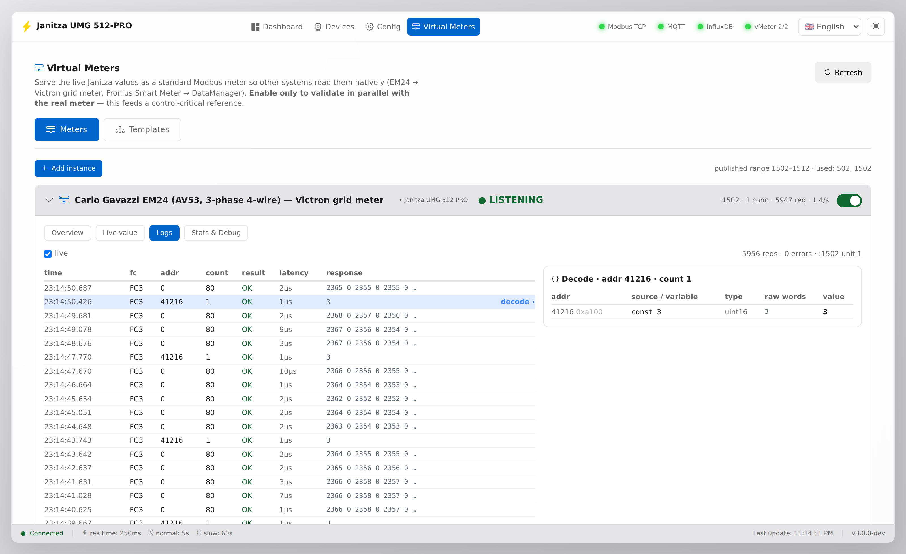
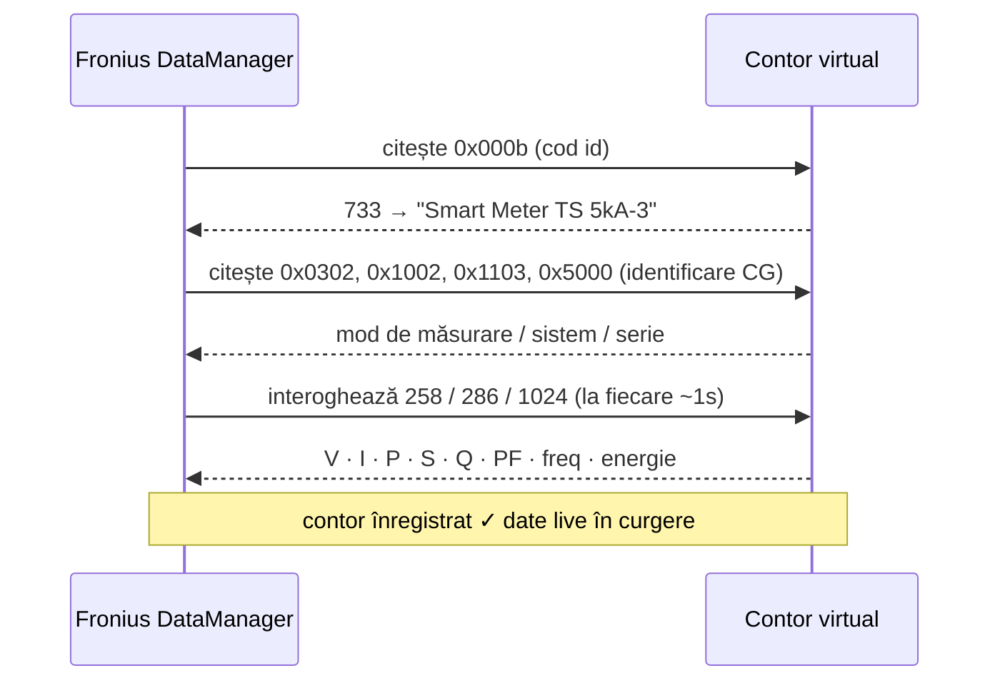

# Motorul de contoare virtuale

[🇬🇧 English](VIRTUAL-METER.md) | 🇷🇴 **Română**

> Transformă **un singur** analizor fizic de calitate a energiei în **mai multe**
> contoare virtuale — fiecare vorbind exact dialectul Modbus pe care îl așteaptă
> un consumator — cu observabilitate completă, integrată, a fiecărei cereri.

Un singur Janitza UMG 512-PRO se află la punctul tău de conexiune la rețea. El
măsoară deja totul: tensiune, curent, putere, factor de putere, frecvență și
energie pe fiecare fază. Între timp, sistemul tău Victron ESS dorește un
*Carlo Gavazzi EM24*, invertorul tău Fronius dorește un *Fronius Smart Meter*,
iar un al treilea sistem dorește pur și simplu SunSpec. În mod normal ai cumpăra
trei contoare. **Aici le definești ca șabloane și le servești pe toate din
singurul contor pe care îl ai deja.**



Fiecare contor virtual este un **server Modbus-TCP izolat** alimentat din valorile
live ale unui **dispozitiv sursă** — Janitza implicit, dar orice dispozitiv pe care
îl interoghează gateway-ul — astfel încât o defecțiune de UI/MQTT nu întrerupe
niciodată contorizarea. Un contor este pur și simplu un **șablon YAML** (o hartă de
registre + legături la surse) — adăugarea unuia nou nu necesită cod. Fiindcă
profilurile de ieșire se leagă de **nume** canonice de registre, același șablon
funcționează pe orice dispozitiv sursă care expune acele nume.

---

## Două moduri de a-l rula



**① Paralel (validare)** — rulezi contorul virtual pe un port liber *lângă*
contorul real, îndrepți un consumator de test (sau pur și simplu tab-ul **Logs**)
către el și compari. Nimic critic pentru control nu depinde de el încă. Așa îți
construiești încrederea și faci reverse-engineering pentru un nou consumator —
fără risc.

**② Consolidare (înlocuire)** — odată validat, contorul virtual devine contorul
consumatorului, iar contorul fizic dedicat este eliminat. **Un singur Janitza
servește acum fiecare consumator** (contor de rețea Victron + limitare export
Fronius + …). Aceasta este starea finală: mai puține cutii, o singură sursă de
adevăr, watchdog-ul de prospețime ca plasă de siguranță.

> Mergi întotdeauna ①→② pe un contor care alimentează o buclă de control. Nu
> conecta niciodată un contor virtual nou-nouț direct în ESS/limitarea exportului
> fără verificarea în paralel.

---

## Cum funcționează



1. **Șablonul** declară fiecare registru: adresă, tip (`int16`/`uint32`/`float`/
   `string`…), scalare, ordinea octeților și de unde provine valoarea sa — un
   registru **live** al **dispozitivului sursă** al contorului (Janitza implicit),
   o **constantă** sau o **sumă** de mai multe registre live.
2. **Motorul** rezolvă șablonul în raport cu cache-ul live și codifică fiecare
   valoare în cuvinte Modbus, reconstruind blocul de registre o dată pe secundă.
3. Fiecare instanță activată rulează **propriul server pymodbus TCP în propriul
   său fir de execuție**.
4. Un **watchdog de prospețime** este nucleul de siguranță: dacă sursa Janitza
   devine învechită (> `stale_after_s`), serverul **oprește răspunsul**, astfel
   încât fail-safe-ul propriu al consumatorului pentru pierderea contorului de
   rețea să se activeze — nu alimentăm niciodată în mod silențios date învechite
   într-o buclă de control. Valorile multi-registru sunt scrise atomic (fără
   rupere de cuvinte).

---

## Fiabilitate și uptime

Un contor virtual poate sta într-o buclă de control (Victron ESS, limitare export
Fronius), așa că motorul este construit pentru a se **auto-repara și a eșua în
siguranță (fail safe)** — niciodată pentru a alimenta date eronate.



Patru gardieni independenți, fiecare rulând pe cont propriu:

1. **Reconectarea sursei** — clientul Modbus Janitza se reconectează automat la un
   socket pierdut (reîncercări + întârziere), astfel încât o întrerupere
   tranzitorie a rețelei să nu scoată datele offline.
2. **Watchdog de prospețime** — dacă valorile devin învechite dincolo de
   `stale_after_s`, contorul **oprește răspunsul** în loc să servească o valoare
   înghețată. Consumatorul își activează apoi propriul fail-safe pentru pierderea
   contorului de rețea. Învechit-dar-servit este singurul lucru pe care nu îl
   facem niciodată.
3. **Recuperare după blocare** — fiecare contor rulează un fir daemon izolat cu
   propria buclă asyncio; un supervizor verifică sănătatea reală a firului
   (`is_alive()`, nu doar un fanion) la fiecare tick și repornește un server mort,
   cu backoff dacă un port este ținut ocupat pentru scurt timp. Corpul
   supervizorului este complet protejat astfel încât să nu poată muri niciodată.
4. **Reconectarea consumatorului** — când un contor revine, consumatorul se
   reconectează în mod normal la serverul TCP; pymodbus acceptă noua conexiune.

**Fără pierdere de date:** cache-ul live păstrează întotdeauna cea mai recentă
citire; motorul servește valoarea cea mai proaspătă sau eșuează în siguranță — nu
servește niciodată date învechite. (Backfill-ul monitorului poate de asemenea să
auto-repare golurile din InfluxDB pe baza înregistrării de la bordul contorului.)

**Costul observabilității:** un singur adaos într-un `deque` din RAM per citire
(latență măsurată în microsecunde cu o singură cifră) — nu atinge niciodată
corectitudinea căii de servire deoarece fiecare apel de statistici este protejat
de excepții.

---

## Observabilitate — vezi exact ce citește consumatorul tău

Fiecare citire pe care o emite un consumator este înregistrată în RAM (fără
configurare, fără persistență): **ultimele 1024 de interogări** cu adresă, număr,
eșantion de răspuns, latență și fanion de eroare, plus contoare live și un grafic
al ratei de cereri pe secundă.

Aceasta nu este o funcție secundară — **este instrumentul care ne-a permis să
facem reverse-engineering pentru protocolul Fronius Smart Meter** (vezi studiul de
caz de mai jos), acum integrat în interfață.

Pagina **Virtual Meters** are două tab-uri principale — **Meters** și **Templates**
— plus un buton **Add instance**. Meters e o listă de **carduri acordeon**, câte
unul per instanță: antetul arată numele, **dispozitivul sursă** (chip-ul `← Janitza
UMG 512-PRO` — dispozitivul ale cărui valori live îl alimentează), starea de
servire (`LISTENING` / `STALE` / `DOWN`), portul, numărul de conexiuni, numărul de
cereri și rata, plus un comutator de activare. Extinde un card pentru patru
**subtab-uri**:

| Subtab | Ce obții |
|--------|----------|
| **Overview** | starea servită, dispozitiv sursă, port/unitate, prospețime, număr de registre, editare / ștergere |
| **Live value** | valorile live servite acum, registru cu registru |
| **Logs** | tabel live al ultimelor interogări — `time · FC · addr · count · OK/EXC · latency · response` · **click pe orice rând pentru a-l decoda într-un panou lateral** |
| **Stats & Debug** | total / erori / rată-cereri / RX / TX / uptime · **grafic cereri-pe-secundă** · **evenimente și erori recente** · cele mai citite registre |

O linie reală din jurnalul de interogări arată astfel:

```
20:44:57.102   FC3   addr 0    count 80   OK    6µs   2343 0 2334 0 2337 0 …
20:44:57.113   FC3   addr 41216 count 1   OK    6µs   3
```

**Meters** — fiecare instanță e un card acordeon cu chip-ul dispozitivului sursă, starea live și valorile servite:



**Logs + decode** — fiecare citire pe care o emite consumatorul, în timp real (așa a fost găsită harta Fronius). Click pe orice rând și se decodează într-un **panou lateral** în dreapta tabelului (rândul rămâne evidențiat): panoul parcurge blocul cerut pe baza template-ului și afișează, pentru fiecare registru, `addr` (dec + hex) · `sursa / variabila` asociată (ex. `_G_ULN[0]`, `_PLN[0]`, `const 1651`) · tipul de date · cuvintele brute · valoarea decodată. E cel mai rapid mod de a confirma că o hartă e corectă — citești exact octeții pe care îi citește consumatorul, deja etichetați:



**Stats & Debug** — contoare, grafic cereri-pe-secundă, registrele pe care consumatorul le citește cel mai mult și **evenimente și erori recente**: motorul ține ultimele 50 de evenimente de ciclu-de-viață per contor în RAM — `started`, `crash` (firul serverului a murit → restart automat), `restart_failed`, `wedged` (viu dar nu mai acceptă conexiuni → force-restart), `stopped` (sursa a devenit stale → contorul oprește răspunsul, ca fail-safe pentru consumator), erori de `supervise`. Așa că, atunci când un consumator raportează o întrerupere, vezi *de ce* a tăcut contorul, nu doar *că* a tăcut. Cea mai recentă eroare/avertisment se publică și pe MQTT (`…/vmeter/<id>/state` → `last_error`), ca [alertd](#monitorizare-prin-mqtt-ex-alertd) să poată face reguli pe ea.


### API

| Endpoint | Scop |
|----------|------|
| `GET /health` | sănătate conștientă de metere (vezi mai jos) — 200 ok/degraded, 503 down |
| `GET /api/virtual-meters` | instanțe + stare live + valori servite |
| `GET /api/virtual-meters/{id}/stats?limit=N` | jurnal de interogări + contoare + rată + per-registru |
| `GET /api/virtual-meters/template/{id}/export` | șablon YAML (descărcare) |
| `POST /api/virtual-meters/templates/import` | importă un șablon YAML (validat înainte de salvare) |
| `PUT /api/virtual-meters/template/{id}` | creează / editează un șablon |
| `POST /api/virtual-meters/{id}/toggle?on=true` | activează / dezactivează o instanță |

### Endpoint de sănătate (probă container + monitoare)

`GET /health` raportează starea agregată a meterelor **activate** și e ce probează
`HEALTHCHECK`-ul Docker:

```json
{ "status": "ok", "enabled_meters": 2, "meters": [
  { "id": "em24_av53", "state": "ok",    "freshness_age_s": 1.3, "port": 1502, "last_error": null },
  { "id": "fronius_ts_native", "state": "ok", "freshness_age_s": 1.3, "port": 502, "last_error": null } ] }
```

Per contor: `ok` (servește + proaspăt) · `stale` (servește dar sursa a devenit
stale → contorul oprește corect răspunsul, fail-safe pentru consumator) · `down`
(activat dar nu servește = defect real). Codul HTTP e **200 pentru ok și degraded**,
și **503 doar când un contor e `down`** — o sursă stale e așteptată și un restart
n-ar repara-o, pe când un contor `down` (crash / pornire eșuată) e un defect real
pe care un restart de container l-ar putea curăța. E intenționat: healthcheck-ul
reflectă *meterele*, nu doar „e serverul web pornit".

### Monitorizare prin MQTT (ex. alertd / Home Assistant)

La fiecare ~10 s, starea completă a fiecărui contor e publicată **retained** pe
`<MQTT_PREFIX>/vmeter/<id>/state` (ex. `janitza/umg512/vmeter/fronius_ts_native/state`) —
imaginea completă pentru monitorizare, **fără a duplica datele electrice**:

```json
{ "id": "fronius_ts_native", "name": "Fronius Smart Meter TS 5kA-3 (native CG)",
  "bind": "0.0.0.0", "port": 502, "unit_id": 1, "registers": 62,
  "enabled": true, "running": true, "state": "ok",
  "connections": [ { "ip": "192.168.1.241", "port": 45098, "connected_s": 4213 } ], "conn_count": 1,
  "requests": 84213, "req_rate": 2.1, "errors": 0,
  "bytes_rx": 4392, "bytes_tx": 21716,
  "last_fresh": "2026-06-18T22:29:17", "freshness_age_s": 1.6, "uptime_s": 198,
  "last_error": null, "ts": 1781821757 }
```

`state` e `ok` / `stale` / `down`. `connections` listează fiecare client live cu
`ip`/`port` (cine citește contorul — Victron-ul / DataManager-ul tău). Orientează
orice monitor spre el — ex. o variabilă **alertd** cu `json_path: state` și reguli:

- `state != "ok"` cât e activat → contorul a încetat să servească (sursă stale sau crash) — alertează operatorul.
- `var_age() > 60` → publisher-ul însuși e căzut (monitorul a crăpat) — câmpul `ts` / vechimea retained face asta trivial.
- `errors` în creștere → consumatorul lovește citiri illegal-address (mapă greșită).
- `last_error` nenul → inspectezi cel mai recent eveniment (crash / restart / stale) fără să deschizi UI-ul.

**Autodiscovery Home Assistant** — dacă `MQTT_HA_DISCOVERY=true`, fiecare contor
virtual e publicat automat ca **device** HA (legat de Janitza prin `via_device`) cu
entități: `serving` (connectivity), `state`, `req/s`, `requests`, `errors`,
`connections`, `data age`, `uptime`, `last error`. Apar în HA fără nicio configurare
manuală — construiești dashboard-uri sau automatizări direct pe ele.

---

## Performanță & latență

Măsurat pe setup-ul de referință (citire blocul sumar de 16 registre):

| Cale | Debit | Latență p50 / p99 |
|------|-------|-------------------|
| Un client, peste LAN | **~10.000 req/s** | ~94 µs / ~189 µs |
| Un client, loopback (pymodbus) | ~8.000 req/s | ~120 µs / ~200 µs |
| 6 clienți concurenți, loopback | **~11.600 req/s** agregat | — |

Serverul **nu e nicidecum bottleneck** — răspunde la zeci de mii de citiri pe
secundă cu latență sub-milisecundă, mult peste orice consumator real.

**Dar citiri rapide ≠ date proaspete.** Lanțul:

```
poll Janitza (grup realtime ~1s) → cache live → bloc reconstruit la fiecare
update_interval_s (1s) → răspuns în ~100 µs
```

Valorile servite se reîmprospătează **cam o dată pe secundă** (poll-ul realtime
Janitza + reconstruirea blocului la 1 s), deci vechimea end-to-end e ≤ ~2 s
(tipic ~1 s). **Poll mai des de ~1 Hz întoarce aceeași valoare** — răspuns rapid
în µs, dar nu date mai noi. Stratul virtual adaugă doar **microsecunde**; cei ~1 s
sunt cadența proprie de măsură a contorului.

Ca să dai mai multă prospețime pe cost de încărcare, scazi `update_interval_s`
(per instanță) *și* intervalul grupului realtime — dar valorile realtime ale
UMG512 sunt deja la ~1 s și poll-ul mai des încarcă contorul fizic. Pentru
puterea de rețea într-o buclă de control, ~1 s e ce oferă contorul.

---

## Șabloane

Un șablon este o hartă de registre. Anatomie:

```yaml
template:
  id: em24_av53                       # filename-safe id
  name: "Carlo Gavazzi EM24 — Victron grid meter"
  byte_order: little                  # EM24 is low-word-first (Reg_s32l)
  transport: { type: tcp, port: 1502, unit_id: 1, bind: "0.0.0.0" }
  registers:
    - { addr: 0x000b, type: uint16, source: { const: 1651 } }            # model id
    - { addr: 0x0028, type: int32, scale: 10, source: { live: "_G_P_SUM3" } }   # total power
    - { addr: 0x0000, type: int32, scale: 10, source: { live: "_G_ULN[0]" } }   # V L1
```

Tipuri de sursă: `{ live: "_NAME" }` (un registru Janitza), `{ const: N }`,
`{ const_str: "TEXT" }`, `{ sum: ["_A","_B","_C"] }` (suma registrelor live).

Șabloane livrate:

| Șablon | Emulează | Consumator | Note |
|--------|----------|------------|------|
| `em24_av53` | Carlo Gavazzi EM24 (AV53, 3 faze) | Victron Venus ESS | dovedit în producție |
| `fronius_ts_native` | Fronius Smart Meter TS 5kA-3 (hartă CG nativă) | Fronius Symo DataManager | vezi studiul de caz |
| `fronius_sunspec_meter` | SunSpec model 213 generic (3 faze, float) | orice client SunSpec-TCP | exemplu SunSpec curat |

Definește-l pe al tău în tab-ul **Templates** (editor cu validare per-rând +
import/export YAML) sau importă un `.yaml` partajat de altcineva:


Când faci **Add instance**, alegi șablonul, portul/unitatea și **dispozitivul
sursă** care îl alimentează (implicit Janitza) — așa că același profil EM24 sau
Fronius poate servi de pe orice dispozitiv pe care îl interoghează gateway-ul.

---

## Studiu de caz — emularea unui Fronius Smart Meter

Calea Victron (EM24) este bine documentată. Calea Fronius nu a fost — iar
călătoria este cea mai bună ilustrare a scopului acestui instrument.

Un Fronius **Smart Meter TS** este un contor **Carlo Gavazzi** rebrănduit. Un Symo
DataManager **nu** îl citește prin SunSpec — el folosește **registre CG/Fronius
proprietare** pentru identificare și **blocurile native `258` / `286` / `1024`**
pentru date. Am descoperit aceasta servind o hartă candidat, apoi **urmărind
tab-ul Logs** pentru a vedea exact ce registre solicita DataManager și în ce
ordine:



Ce a făcut evident jurnalul de interogări (și ce ne-a încurcat la început):

- DM **sondează registre proprietare** (`0x000b`=733, `0x0300`, `0x06aa`) și
  așteaptă **valori, nu zerouri și nu excepții Modbus** — un contor SunSpec generic
  care aruncă excepții acolo este respins.
- **Datele se află în blocurile CG native** `258`/`286`/`1024`, **nu** în SunSpec
  `40071`. Energia reactivă este împărțită `kVArh`/`VArh` de-a lungul blocului.
- DM interoghează datele live ~**1×/secundă** și energia ~**1×/10 s** — vizibil
  direct în graficul Stats.

Rezultatul: un contor virtual alimentat de Janitza pe care un DataManager Fronius
real îl acceptă ca un `Smart Meter TS 5kA-3` cu date complete, live și corecte.
Maparea completă a registrelor este documentată inline în
[`config/templates/fronius_ts_native.yaml`](../config/templates/fronius_ts_native.yaml).

> ⚠️ **Fronius: doar ca PRIMARY meter.** DataManager-ul își citește contorul
> **primary** prin această hartă nativă Carlo Gavazzi — exact calea pe care o
> emulează acest șablon, deci adaugă-l ca meter **primary**. **NU** funcționează
> ca meter *secondary*: DataManager-ul nu lasă un secondary să ia adresa Modbus
> **240** (intră în conflict cu adresa primary-ului), deci ar trebui mai întâi
> să re-adresezi contorul existent. În practică: folosește-l ca să **înlocuiești**
> contorul Smart Meter primary, nu ca să adaugi al doilea.

---

## Hardware testat

Verificat cap-coadă pe echipamente reale:

| Rol | Hardware | Șablon / rezultat |
|-----|----------|-------------------|
| **Contor sursă** | Janitza **UMG 512-PRO** (analizor calitate energie clasa 0.2S) | singurul contor fizic care alimentează tot |
| **Victron ESS** | Victron Venus OS (Ekrano GX) | `em24_av53` — acceptat ca grid meter Carlo Gavazzi **EM24** (în producție) |
| **Fronius** | Fronius **Symo** + **DataManager 2.0** (FW `3.34.1-5`, HW `2.6D`) | `fronius_ts_native` — acceptat ca **Smart Meter TS 5kA-3** *primary*, date live complete |
| **Orice client SunSpec** | — | `fronius_sunspec_meter` — exemplu generic SunSpec 213 |

Stack: Docker · Python + pymodbus · Mosquitto (MQTT) · InfluxDB. Alți consumatori
Carlo Gavazzi / SunSpec ar trebui să meargă cu șablonul potrivit — raportările și
șabloanele noi sunt binevenite (vezi Contribuții).

> 🙏 **Ai un Fronius GEN24?** Noi n-am putut testa unul. Spre deosebire de Symo +
> DataManager 2.0 (care cere harta nativă CG), firmware-ul GEN24 *suportă* un
> contor **SunSpec** pe Modbus-TCP — deci `fronius_sunspec_meter` e probabil
> șablonul potrivit acolo. Dacă ai un GEN24: adaugă acel șablon pe un port liber,
> orientează contorul invertorului spre el, urmărește tab-ul **Logs** ca să vezi
> ce citește, și te rog deschide un issue/PR cu rezultatul. E singurul consumator
> pe care nu-l putem verifica noi — ajutorul comunității îl închide.

## Gotchas & lecții învățate

Note câștigate greu, ca să-ți salveze ore.

**Fronius DataManager**
- Își identifică Smart Meter-ul prin **harta nativă Carlo Gavazzi, nu SunSpec**. Un contor SunSpec-213 curat e citit dar **respins** („Timeout, meter not detected"). Folosește `fronius_ts_native`, nu un șablon SunSpec.
- Identitatea vine din registre proprietare (cod FRONIUS `733` @`0x000b`, measurement mode @`0x0302`, …); datele live sunt în **blocurile native 258 / 286 / 1024**, NU SunSpec `40071`.
- **Doar ca primary** — un meter *secondary* nu poate lua adresa Modbus **240** (conflict cu primary-ul), deci folosește contorul virtual ca să **înlocuiești** primary-ul, nu ca să adaugi un al doilea.
- DM-ul arată **serial / CT ratio / VT ratio ca 0/None** pentru un contor emulat (cache-uiește identitatea per meter-id și le citește din registre pe care nu le-am fixat) — **cosmetic**, toate măsurătorile sunt corecte.

**Victron / Carlo Gavazzi EM24**
- Datele sunt **low-word-first** (`Reg_s32l`: cuvântul 16-bit jos la adresa mai mică). Ordine greșită → valori garbage / inversate.
- Victron detectează modelul din registrul **`0x000b`** (`1651` pentru EM24 AV53) — pune-l corect sau nu e recunoscut.
- **A-total trebuie să fie suma aritmetică a curenților de fază**, nu suma vectorială/de nul (~0) — un A inconsistent cu W duce la respingere.

**Registrele de energie** — activă și reactivă sunt **split**: o parte kWh/kVArh (lasă 0) + o parte Wh/VArh. Pune valoarea întreagă în slotul **Wh/VArh**, altfel consumatorul o citește ×1000.

**General**
- Un contor virtual e **control-critic** — rulează-l mereu ① *în paralel* cu cel real și urmărește tab-ul **Logs** înainte de ② cutover.
- Urmărirea live a citirilor consumatorului (tab-ul Logs) e modul în care a fost descoperită fiecare mapă.
- După un update de UI, dă hard-refresh o dată (bundle-ul JS e cache-busted, dar proxy-urile pot cache-ui).

---

## Pornire rapidă

```bash
# 1. publish a port range for the meters (docker-compose), e.g. 1502-1512 (+ 502)
# 2. drop a template in config/templates/   (or use the UI editor)
# 3. add an instance:
curl -X POST localhost:8080/api/virtual-meters \
     -H 'Content-Type: application/json' \
     -d '{"template":"em24_av53","port":1502,"unit_id":1,"enabled":false}'
# 4. validate IN PARALLEL with the real meter, then enable + point the consumer here
```

> ⚠️ **Un contor virtual poate alimenta o buclă de control** (ESS, limitare
> export). Validează întotdeauna mai întâi în paralel cu contorul real, confirmă
> fail-safe-ul consumatorului pentru pierderea rețelei și abia apoi fă comutarea.
> Watchdog-ul de prospețime este plasa ta de siguranță, nu un substitut pentru
> validare.

---

## Contribuții — adaugă un contor, dezvoltă proiectul

Întregul scop al șabloanelor este că **un contor nou este date, nu cod**. Dacă ai
un consumator care dorește un contor pe care nu îl livrăm încă:

1. Adaugă un șablon în `config/templates/<contorul_tău>.yaml`.
2. Activează-l pe un port liber, îndreaptă consumatorul către el.
3. Deschide tab-ul **Logs** și urmărește ce citește consumatorul — ajustează harta
   până când este mulțumit. (Exact așa a fost construit `fronius_ts_native`.)
4. Exportă șablonul și deschide un PR cu el + o notă despre consumator și firmware.

Idei la care ne-ar plăcea să primim ajutor: mai multe hărți Carlo Gavazzi /
SunSpec / Schneider / Eastron, o vizualizare „diff față de contorul real” per
registru, persistența opțională a jurnalului de interogări și împachetarea
motorului ca serviciu de sine stătător.

Issue-urile și PR-urile sunt binevenite — motorul este mic, izolat și bine
comentat.
